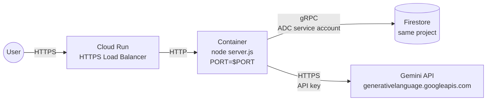
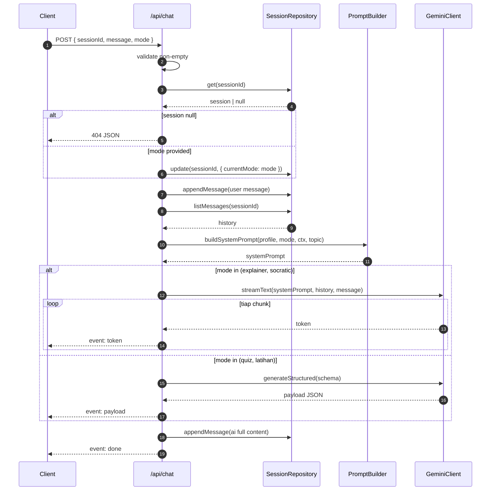
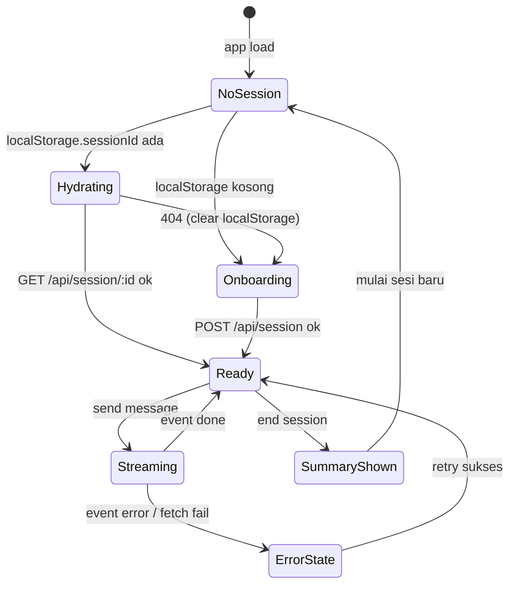

# Design Document — BelajarBareng AI

## Overview

BelajarBareng AI adalah Next.js 14 (App Router) full-stack application yang dideploy sebagai container tunggal ke Google Cloud Run. UI client dan API routes hidup di codebase yang sama, dengan Firestore sebagai single source of truth untuk state sesi dan Gemini 1.5 Flash multimodal sebagai engine AI. Design ini sengaja kompak agar MVP bisa shipping sebelum 31 Mei 2026 — tidak ada layanan eksternal tambahan, tidak ada autentikasi, tidak ada queue. Semua I/O AI mengalir melalui server (server-only API key) dan dikirim ke client via Server-Sent Events (SSE).

Tiga pilar arsitektural baru yang ditambahkan pada iterasi ini:

1. **Markdown_Compiler server-side** — materi yang diunggah (PDF *atau* DOCX) dikompilasi menjadi `Compiled_Markdown` *sebelum* prompt assembly. Hanya bentuk Markdown inilah yang masuk ke prompt Gemini, sehingga byte mentah file tidak ikut menjadi token (token-saving invariant).
2. **Layout_Router per-mode** — halaman `/chat` bukan lagi satu chat universal, melainkan router client yang me-mount tepat satu `Mode_Layout` sesuai `currentMode` sesi. Mengganti mode hanya remount layout target tanpa membuang riwayat pesan.
3. **Quiz_Wizard state machine** — Kuis_Layout punya state machine eksplisit (`idle → uploading → compiled → configuring → running → completed`) yang menggating setup sebelum AI mulai membuat soal.

## Architecture

### High-Level Component Diagram

```mermaid
flowchart LR
    subgraph Browser["🌐 Browser (Client)"]
        Pages["App Router Pages<br/>/, /chat, /summary"]
        Onboarding[OnboardingScreen]
        ModeSel[ModeSelector]
        Router["Layout_Router<br/>(reads currentMode)"]
        PenjelasL[PenjelasLayout]
        SokratikL[SokratikLayout]
        KuisL["KuisLayout<br/>+ AIStatusBox"]
        LatihanL[LatihanLayout]
        ChatStream["ChatStream<br/>+ ReactMarkdown"]
        QuizCmp[QuizComponent]
        LatihanCmp[LatihanComponent]
        SocraticCmp[SocraticComponent]
        ExplainerCmp[ExplainerComponent]
        DocUploader[DocumentUploader<br/>PDF + DOCX]
        SummaryView[SummaryView]
        SessionStoreClient[(localStorage<br/>sessionId)]
    end

    subgraph CloudRun["☁️ Cloud Run — Next.js Server"]
        Health["/api/health"]
        Upload["/api/upload<br/>multipart/form-data"]
        Chat["/api/chat<br/>SSE stream"]
        Summary["/api/summary"]
        SessionRepo[SessionRepository]
        MdCompiler["Markdown_Compiler<br/>lib/markdown-compiler.ts"]
        PromptBuilder["PromptBuilder<br/>base + mode + profile<br/>+ compiledMarkdown only"]
        GeminiClient[GeminiClient<br/>streaming wrapper]
        Mammoth[mammoth lib<br/>DOCX → MD/HTML]
    end

    subgraph GCP["🤖 Google Cloud"]
        Firestore[(Firestore<br/>sessions/{id}/messages)]
        Gemini[Gemini 1.5 Flash<br/>generative-ai SDK]
    end

    Onboarding -->|POST /api/session| Chat
    Pages --> Router
    Router --> PenjelasL
    Router --> SokratikL
    Router --> KuisL
    Router --> LatihanL
    PenjelasL --> ChatStream
    PenjelasL --> DocUploader
    SokratikL --> SocraticCmp
    SokratikL --> ChatStream
    KuisL --> QuizCmp
    LatihanL --> LatihanCmp
    ChatStream --> ExplainerCmp
    ModeSel -->|mode change| Router
    ChatStream -->|POST /api/chat| Chat
    QuizCmp -->|submit answer| Chat
    LatihanCmp -->|attempt| Chat
    DocUploader -->|multipart| Upload
    SummaryView -->|POST /api/summary| Summary
    Pages <-->|read/write| SessionStoreClient

    Upload --> MdCompiler
    MdCompiler -->|PDF path| GeminiClient
    MdCompiler -->|DOCX path| Mammoth
    Upload --> SessionRepo
    Chat --> SessionRepo
    Chat --> PromptBuilder
    Chat --> GeminiClient
    Summary --> SessionRepo
    Summary --> GeminiClient
    PromptBuilder -.reads.-> SessionRepo

    SessionRepo <-->|CRUD| Firestore
    GeminiClient <-->|stream| Gemini
```

### Project Folder Layout (Next.js 14 App Router)

```
belajar-bareng-ai/
├── app/                          # App Router root
│   ├── layout.tsx                # Root layout (fonts, providers)
│   ├── page.tsx                  # Landing + Onboarding
│   ├── chat/
│   │   └── page.tsx              # Main chat experience
│   ├── summary/
│   │   └── page.tsx              # Summary view
│   ├── globals.css               # Tailwind base
│   └── api/
│       ├── health/route.ts       # GET  /api/health
│       ├── session/route.ts      # POST /api/session     (create)
│       ├── upload/route.ts       # POST /api/upload      (multipart)
│       ├── chat/route.ts         # POST /api/chat        (SSE)
│       └── summary/route.ts      # POST /api/summary
│
├── components/
│   ├── OnboardingScreen.tsx
│   ├── ModeSelector.tsx
│   ├── ChatStream.tsx            # SSE consumer + ReactMarkdown
│   ├── MessageBubble.tsx
│   ├── QuizComponent.tsx         # MCQ + essay
│   ├── LatihanComponent.tsx      # Step-by-step reveal
│   ├── SocraticComponent.tsx     # hint reveal control + depth indicator
│   ├── ExplainerComponent.tsx    # structured sections + key terms
│   ├── SummaryView.tsx
│   ├── ErrorBanner.tsx
│   ├── DocumentUploader.tsx      # accept .pdf + .docx (renamed from PdfUploader)
│   ├── AIStatusBox.tsx           # Kuis_Layout sticky right square panel
│   ├── QuizWizard.tsx            # multi-step setup wizard
│   └── layouts/
│       ├── LayoutRouter.tsx      # picks one of below by currentMode
│       ├── PenjelasLayout.tsx    # chat-first, inline DocumentUploader
│       ├── SokratikLayout.tsx    # see Per-Mode Layout Specifications
│       ├── KuisLayout.tsx        # split: question column + AIStatusBox
│       └── LatihanLayout.tsx     # see Per-Mode Layout Specifications
│
├── lib/
│   ├── firestore.ts              # Firestore client init
│   ├── session-repository.ts     # CRUD on sessions + messages
│   ├── session-repository-memory.ts # In-memory fake for dev/testing
│   ├── gemini-client.ts          # Wraps @google/generative-ai
│   ├── markdown-compiler.ts      # PDF (Gemini) | DOCX (mammoth) → Compiled_Markdown
│   ├── prompt-builder.ts         # Compose system prompt (compiledMarkdown only)
│   ├── quiz-state-machine.ts     # idle→uploading→compiled→configuring→running→completed
│   ├── sse.ts                    # encodeSseEvent / parseSseStream
│   ├── validation.ts             # Zod schemas + guards (PDF + DOCX MIME)
│   └── types.ts                  # Shared TS types
│
├── hooks/
│   ├── useSession.ts             # localStorage sessionId + hydrate
│   └── useChatStream.ts          # SSE consumer hook
│
├── public/
├── Dockerfile
├── .dockerignore
├── next.config.mjs               # output: 'standalone'
├── tailwind.config.ts
├── tsconfig.json
└── package.json
```

### Runtime Topology on Cloud Run



- Single revision, min-instances 0, max-instances 5 untuk MVP.
- Service account dengan role `roles/datastore.user` untuk Firestore.
- `GEMINI_API_KEY` di-mount sebagai secret dari Secret Manager.
- Concurrency default 80, request timeout 300s (untuk SSE long-lived stream).

## Components and Interfaces

### Server-Side Modules

#### `lib/types.ts`
```typescript
export type ProfileType = 'mahasiswa' | 'sma';
export type LearningMode = 'explainer' | 'socratic' | 'quiz' | 'latihan';
export type Role = 'user' | 'ai';

// Material file MIME types diperluas: PDF + DOCX (Req 2.4, 16.3)
export type MaterialMimeType =
  | 'application/pdf'
  | 'application/vnd.openxmlformats-officedocument.wordprocessingml.document';

export interface Session {
  sessionId: string;
  profileType: ProfileType;
  topic?: string;
  // Layout_Router input — halaman /chat memilih layout berdasarkan field ini
  currentMode: LearningMode;
  documentContext?: DocumentContext;
  // Quiz wizard state — disimpan agar UI bisa hydrate kembali setelah reload (Req 17)
  quizState?: QuizState;
  quizConfig?: QuizConfig;
  startedAt: string;        // ISO
  endedAt?: string;         // ISO
}

export interface DocumentContext {
  fileName: string;
  sizeBytes: number;
  mimeType: MaterialMimeType;
  // Konten Markdown hasil Markdown_Compiler (PDF: Gemini, DOCX: mammoth).
  // Hanya field inilah yang boleh masuk ke prompt AI — byte mentah file
  // TIDAK PERNAH disimpan di sini setelah compile selesai (Req 16.5).
  compiledMarkdown: string;
  uploadedAt: string;
  // Optional: kalau compile-time menghasilkan warnings (mis. mammoth styles)
  compilerWarnings?: string[];
}

export type QuizState =
  | 'idle'
  | 'uploading'
  | 'compiled'
  | 'configuring'
  | 'running'
  | 'completed';

export interface QuizConfig {
  type: 'essay' | 'mcq' | 'mixed';
  count: 3 | 5 | 10;
  // Soal yang sudah dihasilkan + dijawab; dipakai progress bar
  answeredCount: number;
}

export interface Message {
  messageId: string;
  sessionId: string;
  role: Role;
  mode: LearningMode;
  content: string;
  createdAt: string;
  // Optional structured payload untuk quiz/latihan/explainer/socratic
  payload?: ExplainerPayload | SocraticPayload | QuizPayload | LatihanPayload;
}

export type ExplainerSectionLabel = 'Inti' | 'Analogi' | 'Contoh' | 'TL;DR';

export interface ExplainerPayload {
  kind: 'explainer';
  title: string;
  sections: { label: ExplainerSectionLabel; body: string }[];
  keyTerms?: string[];
}

export interface SocraticPayload {
  kind: 'socratic';
  question: string;
  // Tepat 3 hint dari paling samar → paling spesifik (Req 5.3)
  hints: [string, string, string] | string[];
  // Indikator depth dialog Sokratik (Req 5.4)
  depth?: number;
}

export interface QuizPayload {
  kind: 'quiz';
  type: 'mcq' | 'essay';
  question: string;
  options?: string[];        // hanya untuk mcq
  correctAnswer: string;     // server-only, tidak dikirim ke client mentah
  explanation?: string;
  // Posisi soal pada batch — untuk progress n/total
  index: number;
  total: number;
}

export interface LatihanPayload {
  kind: 'latihan';
  question: string;
  steps: { title: string; detail: string }[];
  // Tingkat kesulitan — untuk tombol "lebih mudah / lebih sulit" (Req 7.5)
  difficulty?: 'mudah' | 'sedang' | 'sulit';
}

export interface SummaryPayload {
  topicsCovered: string[];
  keyPoints: string[];
  recommendations: string[];
  createdAt: string;
}
```

#### `lib/session-repository.ts`
```typescript
export interface SessionRepository {
  create(input: { profileType: ProfileType }): Promise<Session>;
  get(sessionId: string): Promise<Session | null>;
  update(sessionId: string, patch: Partial<Session>): Promise<void>;
  setDocumentContext(sessionId: string, ctx: DocumentContext): Promise<void>;
  appendMessage(sessionId: string, msg: Omit<Message, 'messageId'>): Promise<Message>;
  listMessages(sessionId: string): Promise<Message[]>;
  saveSummary(sessionId: string, summary: SummaryPayload): Promise<void>;
}
```

Implementasi memakai Firestore Admin SDK (`@google-cloud/firestore`) yang otomatis pickup Application Default Credentials di Cloud Run.

#### `lib/prompt-builder.ts`
```typescript
export function buildSystemPrompt(args: {
  profile: ProfileType;
  mode: LearningMode;
  documentContext?: DocumentContext;
  topic?: string;
}): string;
```

Komposisi:

```
[BASE_TONE]
+ [MODE_INSTRUCTION[mode]]
+ [PROFILE_INSTRUCTION[profile]]
+ optional: "Konteks dokumen:\n<compiledMarkdown>"   ← HANYA Markdown, bukan byte mentah
+ optional: "Topik sesi: <topic>"
```

**Token-saving invariant (Req 16.5).** `buildSystemPrompt` *hanya* membaca
`documentContext.compiledMarkdown`. Tidak ada code-path yang membaca
field byte/base64 dari sesi — itu memang tidak pernah disimpan ke Session_Store
setelah Markdown_Compiler selesai. Property 19 menjaga invariant ini secara
mekanis.

Konstanta (lihat implementasi di `lib/prompt-builder.ts` untuk teks lengkap; berikut ringkasan):

```typescript
const BASE_TONE = `Kamu adalah BelajarBareng AI, teman belajar personal yang sabar
dan tidak pernah menghakimi. Kamu berbicara seperti kakak senior yang pintar dan
relate. Gunakan bahasa Indonesia santai tapi informatif. Selalu ajak user untuk
memahami, bukan sekedar menghafal.`;

const MODE_INSTRUCTION: Record<LearningMode, string> = {
  explainer: 'Jelaskan dengan analogi sehari-hari yang mudah dipahami pelajar Indonesia.',
  socratic:  'Jangan langsung jawab. Ajukan pertanyaan yang memancing user berpikir sendiri.',
  quiz:      'Buat soal yang relevan dengan materi. Koreksi dengan penjelasan, bukan hanya benar/salah. Jawab dalam JSON terstruktur sesuai schema QuizPayload.',
  latihan:   'Bimbing user step-by-step. Jangan langsung kasih jawaban sebelum user mencoba. Jawab dalam JSON terstruktur sesuai schema LatihanPayload.',
};

const PROFILE_INSTRUCTION: Record<ProfileType, string> = {
  sma:       'User adalah pelajar SMA (15–18 tahun). Pakai kosakata dan analogi yang dekat dengan dunia anak SMA.',
  mahasiswa: 'User adalah mahasiswa (18–24 tahun). Pakai kosakata dan analogi yang dekat dengan kehidupan mahasiswa.',
};
```

#### `lib/markdown-compiler.ts` (baru)

Modul server-side yang melakukan kompilasi materi unggahan menjadi
`Compiled_Markdown` *sebelum* pipeline prompt menyentuhnya. Punya dua jalur
implementasi yang dipilih berdasarkan MIME type input:

```typescript
export interface CompileResult {
  compiledMarkdown: string;
  warnings?: string[];
}

export interface MarkdownCompiler {
  // Untuk PDF — pakai Gemini multimodal yang sudah ada (Req 16.2)
  compilePdf(args: { pdfBase64: string }): Promise<CompileResult>;

  // Untuk DOCX — pakai mammoth, TANPA panggilan Gemini (Req 16.3)
  compileDocx(args: { buffer: Buffer }): Promise<CompileResult>;

  // Dispatch berdasarkan MIME — handler /api/upload memanggil ini
  compile(args: {
    mimeType: MaterialMimeType;
    buffer: Buffer;
  }): Promise<CompileResult>;
}
```

**PDF path.** Memanggil `geminiClient.extractFromPdf()` dengan instruction
`"Ekstrak konten utama PDF ini sebagai Markdown teks-saja untuk konteks belajar.
Jangan sertakan gambar atau image data, hanya struktur dokumen (headings, list,
tabel sederhana, paragraf)."`. Hasil string dibungkus sebagai `Compiled_Markdown`
tanpa post-processing tambahan.

**DOCX path.** Memakai pustaka [`mammoth`](https://www.npmjs.com/package/mammoth)
(versi `^1.7`) yang dipilih karena (a) pure JS, jalan di Node tanpa native
binding, (b) punya dua mode konversi yang relevan: `convertToHtml()` dan
`extractRawText()`. Strategi:

```typescript
import mammoth from 'mammoth';

async function compileDocx({ buffer }: { buffer: Buffer }) {
  // Coba HTML dulu agar struktur (heading, list) terjaga
  const html = await mammoth.convertToHtml({ buffer });
  // html.value adalah HTML string; kita konversi ke Markdown ringan
  // dengan helper htmlToMarkdown() (turndown, atau implementasi sendiri
  // untuk subset tag yang mammoth keluarkan: h1-h6, p, ul, ol, li, strong, em, a)
  const compiledMarkdown = htmlToMarkdown(html.value);

  // Jika hasil terlalu pendek (kurang dari ~100 char) atau kosong, fallback
  // ke extractRawText untuk dokumen tanpa formatting yang signifikan.
  if (compiledMarkdown.trim().length < 100) {
    const raw = await mammoth.extractRawText({ buffer });
    return { compiledMarkdown: raw.value, warnings: html.messages.map(m => m.message) };
  }
  return { compiledMarkdown, warnings: html.messages.map(m => m.message) };
}
```

Helper `htmlToMarkdown()` cukup untuk subset tag yang dihasilkan mammoth.
Pilihan dependency: `turndown` (^7.x) jika kita butuh konversi HTML→MD yang
lebih komprehensif. Untuk MVP cukup implementasi mini in-house karena set
tag yang mammoth keluarkan sangat terbatas dan deterministik.

**Output rule (Req 16.5).** Method ini *tidak pernah* mengembalikan byte
mentah, base64 string PDF, atau XML/ZIP DOCX. Hanya teks Markdown. Buffer
input disimpan di scope local function dan di-discard setelah call selesai.

**Error mapping (Req 16.7).** Jika jalur PDF melempar `GeminiError` atau
jalur DOCX melempar (mammoth runtime error / corrupt zip), `markdown-compiler`
melempar `CompilerError` yang oleh `/api/upload` dipetakan ke HTTP 502 dengan
pesan `"AI sedang sibuk, coba lagi sebentar"`. Tidak ada partial Document_Context
yang ditulis ke Session_Store dalam kasus error.

**Cache reuse (Req 16.6).** `/api/upload` mengecek `session.documentContext`
sebelum compile. Jika ada dan `fileName + sizeBytes` sama dengan request, kita
return shortcut tanpa compile ulang. User yang upload file baru otomatis
overwrite.

#### `lib/quiz-state-machine.ts` (baru)

Pure function state machine untuk Kuis_Layout. Tidak menyentuh I/O — hanya
tabel transisi.

```typescript
export type QuizEvent =
  | { kind: 'UPLOAD_STARTED' }
  | { kind: 'COMPILE_DONE' }
  | { kind: 'CONFIGURE_OPENED' }
  | { kind: 'CONFIRM_CONFIG'; config: QuizConfig }
  | { kind: 'BATCH_DONE' }
  | { kind: 'STOP' };

const TRANSITIONS: Record<QuizState, Partial<Record<QuizEvent['kind'], QuizState>>> = {
  idle:        { UPLOAD_STARTED:    'uploading' },
  uploading:   { COMPILE_DONE:      'compiled' },
  compiled:    { CONFIGURE_OPENED:  'configuring' },
  configuring: { CONFIRM_CONFIG:    'running' },
  running:     { BATCH_DONE:        'completed', STOP: 'completed' },
  completed:   {},
};

export function reduceQuiz(state: QuizState, event: QuizEvent): QuizState {
  const next = TRANSITIONS[state][event.kind];
  return next ?? state;   // unknown transition → no-op (Req 17.9)
}
```

Property 20 memvalidasi: untuk semua `(state, event)`, output cocok dengan
tabel di atas; kombinasi yang tidak ada di tabel tidak boleh mengubah state.


Membungkus `@google/generative-ai` SDK. Tiga fungsi utama:

```typescript
export interface GeminiClient {
  // 4.3, 10.x: streaming text untuk explainer/socratic
  streamText(args: {
    systemPrompt: string;
    history: { role: 'user' | 'model'; text: string }[];
    userMessage: string;
  }): AsyncIterable<string>;

  // 2.3, 2.4: ekstraksi konten PDF inline base64
  extractFromPdf(args: {
    pdfBase64: string;
    mimeType: 'application/pdf';
    instruction: string;
  }): Promise<string>;

  // 6.x, 7.x, 8.x: structured JSON output (responseSchema)
  generateStructured<T>(args: {
    systemPrompt: string;
    history: { role: 'user' | 'model'; text: string }[];
    userMessage: string;
    schema: object;          // Gemini response schema
  }): Promise<T>;
}
```

Catatan implementasi:
- Model: `gemini-1.5-flash` untuk semua mode (cepat & multimodal).
- PDF dikirim sebagai inline part: `{ inlineData: { data: base64, mimeType: 'application/pdf' } }`.
- Untuk quiz/latihan/summary, gunakan `generationConfig.responseMimeType = 'application/json'` dan `responseSchema` agar Gemini mengembalikan JSON valid.
- Streaming pakai `model.generateContentStream()` lalu yield `chunk.text()`.

#### `lib/sse.ts`

Helper untuk format Server-Sent Events sesuai spec W3C:

```typescript
export type SseEvent =
  | { type: 'token'; data: string }
  | { type: 'payload'; data: QuizPayload | LatihanPayload }
  | { type: 'done'; data: { messageId: string } }
  | { type: 'error'; data: { message: string } };

export function encodeSseEvent(evt: SseEvent): string;
// Format: `event: <type>\ndata: <json>\n\n`
```

Server menggunakan `ReadableStream` Web API yang dikembalikan dari Route Handler.

### API Route Specifications

Semua endpoint berada di Node.js runtime (`export const runtime = 'nodejs'`) karena memakai Firestore Admin SDK dan PDF parsing.

#### `POST /api/session`
Membuat anonymous session.

| Field | Type | Notes |
|---|---|---|
| Request body | `{ profileType: ProfileType }` | JSON |
| Response 201 | `{ sessionId: string, currentMode: 'explainer' }` | |
| Response 400 | `{ error: 'Profil tidak valid' }` | profileType bukan `mahasiswa`/`sma` |

#### `POST /api/upload`
Upload Material_File (PDF *atau* DOCX) dan kompilasi ke `Compiled_Markdown`.

| Field | Type | Notes |
|---|---|---|
| Content-Type | `multipart/form-data` | |
| Form fields | `sessionId`, `file` | |
| Response 200 | `{ fileName, sizeBytes, mimeType, ready: true, cached?: boolean }` | `cached: true` jika compile dilewati (Req 16.6) |
| Response 400 | `{ error: 'Hanya file PDF atau DOCX yang didukung' }` | MIME bukan PDF dan bukan DOCX (Req 2.7) |
| Response 413 | `{ error: 'Ukuran file melebihi batas 10 MB' }` | size > 10 MB |
| Response 404 | `{ error: 'Sesi tidak ditemukan' }` | sessionId invalid |
| Response 502 | `{ error: 'AI sedang sibuk, coba lagi sebentar' }` | Gemini gagal (PDF) atau mammoth gagal (DOCX) — Document_Context tidak di-write (Req 16.7) |

Flow:

1. Validasi `sessionId` ada di Firestore.
2. Validasi MIME ∈ {`application/pdf`, `application/vnd.openxmlformats-officedocument.wordprocessingml.document`} dan `size ≤ 10 MB`.
3. Cek cache: jika `session.documentContext.fileName === file.name` dan `sizeBytes` sama, skip ke step 6 (Req 16.6, set `cached: true`).
4. Konversi `File` → `Buffer` lalu panggil `markdownCompiler.compile({ mimeType, buffer })`.
   - PDF jalur: encode base64 → `geminiClient.extractFromPdf()`.
   - DOCX jalur: `mammoth.convertToHtml({ buffer })` → `htmlToMarkdown()`, fallback ke `mammoth.extractRawText()` jika hasil terlalu pendek.
5. Simpan `DocumentContext` (`fileName`, `sizeBytes`, `mimeType`, `compiledMarkdown`, `uploadedAt`) ke session via `repo.setDocumentContext()`. Buffer mentah & base64 string keluar dari scope dan tidak ditulis ke Session_Store (Req 16.5).
6. Return metadata.

Error mapping: `GeminiError | CompilerError` → 502, `FirestoreError` → 503, validation → 400/413.

#### `POST /api/chat`
Chat utama dengan SSE streaming.

| Field | Type | Notes |
|---|---|---|
| Request body | `{ sessionId, message, mode? }` | mode optional, jika ada update currentMode |
| Response | `text/event-stream` | SSE |
| Events | `event: token` (incremental text), `event: payload` (quiz/latihan structured), `event: done` (final), `event: error` | |
| Error 400 | `{ error: 'Pesan tidak boleh kosong' }` | message empty / whitespace |
| Error 404 | `{ error: 'Sesi tidak ditemukan' }` | session not found |
| Error 502 | event: error → "AI sedang sibuk, coba lagi sebentar" | Gemini error |
| Error 503 | `{ error: 'Layanan penyimpanan belum tersedia, coba lagi' }` | Firestore error |

Flow:



#### `POST /api/summary`
Generate dan simpan summary akhir sesi.

| Field | Type | Notes |
|---|---|---|
| Request body | `{ sessionId }` | |
| Response 200 | `SummaryPayload` | |
| Response 404 | `{ error: 'Sesi tidak ditemukan atau kosong' }` | session/messages tidak ada |
| Response 502 | `{ error: 'AI sedang sibuk, coba lagi sebentar' }` | Gemini error |

Flow: load messages → kirim ke Gemini dengan structured response (schema `SummaryPayload`) → simpan ke session → return.

#### `GET /api/health`
Health check Cloud Run.

| Response 200 | `{ status: 'ok' }` |

Implementasi minimal: tidak menyentuh Firestore/Gemini, hanya echo status — agar liveness probe tidak gagal saat backend lambat.

### Frontend Components

#### Page: `app/page.tsx` (Landing + Onboarding)
- Cek `localStorage.sessionId`.
- Jika ada → redirect ke `/chat`.
- Jika tidak → render `<OnboardingScreen />`.

#### `OnboardingScreen.tsx`
- Toggle dua kartu: Mahasiswa | Pelajar SMA.
- Tombol "Mulai Belajar" → `POST /api/session` → simpan `sessionId` di localStorage → push `/chat`.

#### `app/chat/page.tsx`

Halaman ini sekarang **bukan layout chat universal**, melainkan tipis di luar
`<LayoutRouter />`. Tugas page hanya:

1. Hydrate `useSession()` (baca `sessionId`, fetch session + messages).
2. Render header global: brand + `<ModeSelector />` + tombol "Akhiri Sesi".
3. Render `<LayoutRouter currentMode={session.currentMode} />` yang memilih
   layout per-mode.
4. Render `<ErrorBanner />` saat ada `lastError`.

```
┌──────────────────────────────────────────────┐
│  Header: brand + ModeSelector + EndSession   │
├──────────────────────────────────────────────┤
│                                              │
│  <LayoutRouter>                              │
│   └── one of:                                │
│       PenjelasLayout | SokratikLayout |      │
│       KuisLayout     | LatihanLayout         │
│                                              │
└──────────────────────────────────────────────┘
```

Detail per-layout dijelaskan di section
[Per-Mode Layout Specifications](#per-mode-layout-specifications).

State management lokal pakai `useReducer` di page level — tidak perlu Redux/Zustand untuk MVP. Hook `useSession()` mengangani:
1. Pada mount: baca `sessionId` dari localStorage; jika tidak ada → redirect `/`.
2. Fetch session metadata + listMessages → hydrate state.
3. Expose `{ session, messages, dispatch }`.

#### `components/layouts/LayoutRouter.tsx`

Komponen client tipis. Logika:

```typescript
const VALID: ReadonlyArray<LearningMode> = ['explainer', 'socratic', 'quiz', 'latihan'];

export function LayoutRouter({ currentMode, ...props }: { currentMode: string; /* shared props */ }) {
  // Fallback ke explainer jika nilai tidak dikenali (Req 15.5)
  const mode = (VALID as readonly string[]).includes(currentMode)
    ? currentMode as LearningMode
    : 'explainer';

  switch (mode) {
    case 'explainer': return <PenjelasLayout {...props} />;
    case 'socratic':  return <SokratikLayout {...props} />;
    case 'quiz':      return <KuisLayout    {...props} />;
    case 'latihan':   return <LatihanLayout {...props} />;
  }
}
```

**Re-mount semantics (Req 15.3, 15.4).** `messages` dimiliki oleh `useSession()`
di parent page, *bukan* di dalam layout. Saat `currentMode` berganti,
`LayoutRouter` me-render layout baru. React membongkar layout lama dan
mounting layout baru, tapi state `messages` tetap utuh karena tinggal di scope
di luar router. Property 18 mengukuhkan invariant ini.

**Idempotency.** Re-render dengan `currentMode` yang sama tidak boleh menyebabkan
unmount; React mengetahui ini secara otomatis selama tipe komponen tidak berubah.

#### `ModeSelector.tsx`
- Segmented control 4 mode dengan icon.
- Saat user klik mode baru → optimistic update `currentMode` lokal, kirim mode bersama pesan berikutnya (atau immediate `POST /api/chat` dengan `message: ''`? — cukup carry di state, simpan saat next message).
- Untuk memenuhi 3.3, kirim `mode` di field body request berikutnya; Chat API akan persist via `update()`.

#### `DocumentUploader.tsx` (rename dari `PdfUploader.tsx`)
- Input `<input type="file" accept="application/pdf,application/vnd.openxmlformats-officedocument.wordprocessingml.document,.pdf,.docx">`.
- Validasi client-side MIME + size 10 MB sebelum kirim, gunakan validator yang sama dengan server.
- Pada upload sukses, tampilkan badge nama file + ukuran dan icon yang berbeda untuk PDF (📄) vs DOCX (📝).
- Inline di composer Penjelas_Layout (Req 4.5) dan juga dipakai di Kuis_Wizard step 1.

#### `ChatStream.tsx`
- Consumer SSE menggunakan `fetch()` + `ReadableStream` (bukan `EventSource`, karena `EventSource` tidak mendukung POST).
- Pseudo:
  ```typescript
  const reader = response.body!.getReader();
  const decoder = new TextDecoder();
  let buffer = '';
  while (true) {
    const { value, done } = await reader.read();
    if (done) break;
    buffer += decoder.decode(value, { stream: true });
    for (const evt of parseSseEvents(buffer)) { dispatch(evt); }
  }
  ```
- Render text dengan `react-markdown` + `remark-gfm`. Selama streaming, pesan AI di-append ke buffer dan markdown di-rerender setiap N ms (debounce ringan).

#### `QuizComponent.tsx`
- Props: `payload: QuizPayload`.
- `mcq` → grup radio dari `options[]`.
- `essay` → `<textarea>`.
- Tombol "Cek Jawaban" → kirim ke `/api/chat` dengan `message = JSON.stringify({ kind: 'quiz_answer', answer })` — server akan compose prompt evaluasi dan stream feedback.
- Setelah feedback diterima, tampilkan banner benar/salah + penjelasan.

#### `LatihanComponent.tsx`
- Props: `payload: LatihanPayload`.
- Render `steps[]` dengan tombol "Tampilkan Langkah" per step. Default `revealed[i] = false`.
- Reveal hanya step yang diklik (tidak auto-cascade) — invariant di Property 7.
- Field "Coba Jawaban" untuk mengirim percobaan ke server (mode=latihan akan respond petunjuk, bukan jawaban final).

#### `SummaryView.tsx`
- Render `topicsCovered`, `keyPoints`, `recommendations` sebagai list.
- Tombol "Mulai Sesi Baru" (clear localStorage + redirect `/`) atau "Selesai" (close).

#### `ErrorBanner.tsx`
- Tampil di atas chat saat `event: error` SSE atau fetch error.
- Tombol "Coba Lagi" → re-dispatch pesan terakhir dari history.

### Client Session State Management



Storage keys:
- `localStorage.belajar.sessionId` — string sessionId (Requirement 1.3, 9.3).
- Tidak ada PII lain disimpan di client (Requirement 14.2).

## Data Models

### Firestore Schema

Single root collection `sessions` dengan sub-collection `messages`:

```
sessions/{sessionId}
  ├── profileType: 'mahasiswa' | 'sma'
  ├── topic?: string
  ├── currentMode: 'explainer' | 'socratic' | 'quiz' | 'latihan'
  ├── documentContext?: {
  │     fileName: string,
  │     sizeBytes: number,
  │     mimeType: 'application/pdf'
  │            | 'application/vnd.openxmlformats-officedocument.wordprocessingml.document',
  │     compiledMarkdown: string,        // Compiled_Markdown — satu-satunya
  │                                       // representasi materi yang masuk prompt (Req 16.5)
  │     compilerWarnings?: string[],     // hanya untuk DOCX (mammoth messages)
  │     uploadedAt: Timestamp
  │   }
  ├── quizState?: 'idle' | 'uploading' | 'compiled'
  │             | 'configuring' | 'running' | 'completed'
  ├── quizConfig?: {
  │     type: 'essay' | 'mcq' | 'mixed',
  │     count: 3 | 5 | 10,
  │     answeredCount: number
  │   }
  ├── summary?: {
  │     topicsCovered: string[],
  │     keyPoints: string[],
  │     recommendations: string[],
  │     createdAt: Timestamp
  │   }
  ├── startedAt: Timestamp
  └── endedAt?: Timestamp

  └── messages/{messageId}
        ├── role: 'user' | 'ai'
        ├── mode: LearningMode
        ├── content: string
        ├── payload?: ExplainerPayload | SocraticPayload
        │           | QuizPayload | LatihanPayload
        └── createdAt: Timestamp
```

Index: composite index pada `messages` collection group dengan `createdAt ASC` (Firestore otomatis untuk single-field).

**Field yang OBSOLETE / dihapus pada iterasi ini:**
- `documentContext.extractedText` lama → diganti `documentContext.compiledMarkdown`. Tidak ada migrasi backward — sesi yang ada di environment dev di-flush sebelum rollout (kompetisi MVP, belum ada user produksi).
- Tidak ada field byte/base64 untuk file mentah — tidak pernah ditulis ke Firestore.

### ID Generation

- `sessionId`: `crypto.randomUUID()` di server (Requirement 14.1 — uniqueness).
- `messageId`: Firestore auto-id.

### Size Considerations

- `documentContext.compiledMarkdown` di-cap ke 200 KB (≈ 50 halaman teks). Jika hasil compile lebih besar, server melakukan truncation dengan tail "…[dipotong]".
- Firestore document limit 1 MiB → cukup untuk MVP.

## Web Research Findings

Sebelum memilih bentuk visual untuk `Sokratik_Layout` (Req 5) dan
`Latihan_Layout` (Req 7), kami melakukan literature & competitor scan untuk
memetakan pola UX yang sudah terbukti. Ringkasan di bawah disusun ulang dari
sumber publik; setiap baris menyertakan link ke sumber asli.

### Research: Socratic Mode UX

Tujuan: mode Sokratik harus *memancing*, bukan menjawab. Hint reveal harus
bertahap, dan user butuh tahu seberapa dalam diskusi sudah masuk.

**Sumber kunci.**

1. [Khanmigo — Khan Academy AI tutor](https://blog.khanacademy.org/lesson-planner/) memposisikan dirinya sebagai tutor yang menantang user untuk berpikir kritis tanpa memberi jawaban langsung. Pola interaksinya text-first chat, hint diberikan sebagai prompt baru dari AI, bukan tombol UI eksplisit. Konten direkomposisi: tone "challenge to think, not answer".
2. [Khanmigo Lite system prompt (DocsBot)](https://docsbot.ai/prompts/education/khanmigo-lite-tutor) menunjukkan model selalu merespons dengan pertanyaan terpandu, memecah konsep kompleks menjadi langkah-langkah, dan fokus pada pemahaman murid. Konten direkomposisi.
3. [Paul-Elder Critical Thinking Framework (Designorate, 2023)](https://www.designorate.com/critical-thinking-paul-elder-framework/) memetakan pertanyaan kritis dalam tiga tahap: observasi → analisis → solusi. Konten direkomposisi.
4. [Adaptation of Paul's Six Types of Socratic Questions (ResearchGate)](https://www.researchgate.net/figure/Adaptation-of-Pauls-classification-of-the-Six-Types-of-Socratic-Questions-24_tbl1_233414380) menyebut bahwa Paul-Elder mengklasifikasi Socratic questioning dalam tiga kategori: spontaneous, exploratory, dan focused. Konten direkomposisi.
5. [Socratic Dialogue Scaffolds overview (EmergentMind, 2024)](https://api.emergentmind.com/topics/socratic-dialogue-scaffolds) mendokumentasikan bahwa scaffold Sokratik berbasis iterative questioning meningkatkan engagement dan reasoning, terutama bila adaptif terhadap cognitive state user.
6. [SocraticAI — scaffolded LLM tutor (arXiv 2512.03501)](https://arxiv.org/html/2512.03501v1) mengintegrasikan LLM dengan structural constraints (reflective engagement + daily limits) alih-alih melarang pemakaian. Konten direkomposisi.

> Konten dari sumber-sumber di atas direkomposisi untuk kepatuhan lisensi; tidak ada blok verbatim > 30 kata yang disalin.

**Pola UX yang muncul berulang.**
- *Question-first composition*: AI bubble paling atas selalu pertanyaan, bukan jawaban.
- *Tiered hint system*: hint disusun dari paling samar ke paling spesifik (Paul-Elder: spontaneous → exploratory → focused), tidak satu blob.
- *Depth indicator*: counter atau breadcrumb yang menunjukkan kedalaman dialog (level 1, level 2, …) supaya user tahu progres.
- *Reflection prompt*: tombol cepat "Aku rasa..." / "Mungkin karena..." yang men-seed jawaban tanpa menjawab untuk user.
- *No-answer guard*: jika user minta jawaban langsung, AI tetap mengarahkan ke pertanyaan dengan kompromi memberi hint level berikutnya.

#### Layout options dipertimbangkan

**Option A — Single-column dialog dengan hint drawer di atas composer**

```
┌─────────────────────────────────────────────┐
│ Header: badge "Sokratik" + Depth: 2/?       │
├─────────────────────────────────────────────┤
│ AI: pertanyaan terpandu (font besar)        │
│ User: jawaban                               │
│ AI: pertanyaan lanjutan (depth bertambah)   │
│ ...                                         │
├─────────────────────────────────────────────┤
│ [Petunjuk bertahap (0/3)] ▾  expand          │
│ ┌────────────────────────────────────────┐  │
│ │ • Hint level 1 (samar)                 │  │
│ │ • Hint level 2 (sedang)                │  │
│ │ • Hint level 3 (spesifik)              │  │
│ └────────────────────────────────────────┘  │
├─────────────────────────────────────────────┤
│ [Aku rasa...] [Mungkin karena...] [Bingung] │
│ [textarea jawaban] ............... [Kirim]  │
└─────────────────────────────────────────────┘
```

Pros: familiar (pure chat), mobile-friendly, minim shift visual saat depth berganti.
Cons: depth indicator mudah ditelan oleh scroll; hint drawer tidak persisten di viewport.

**Option B — Two-column: dialog kiri + persistent rail kanan (depth + hint stack)**

```
┌──────────────────────────────────┬─────────────┐
│ Dialog AI↔User (scrollable)      │ Depth: 2    │
│                                  │ ─────       │
│ AI: ...                          │ Hint stack  │
│ User: ...                        │  ○ ○ ○      │
│                                  │ [Reveal hint│
│                                  │   berikut]  │
│                                  │             │
├──────────────────────────────────┤             │
│ [textarea + Kirim]               │             │
└──────────────────────────────────┴─────────────┘
```

Pros: depth + hints selalu di viewport; pola ini selaras dengan `KuisLayout`
(rail kanan sticky), sehingga konsistensi visual antar mode tinggi.
Cons: membutuhkan ≥ 768px lebar; di mobile rail collapse jadi drawer (extra work).

**Option C — Stepper + chat hybrid: dialog di bawah, depth stepper di atas**

```
┌─────────────────────────────────────────────┐
│ ① Observasi  ─  ● Analisis  ─  ○ Solusi     │  ← Paul-Elder stepper
│ (depth bertambah saat AI shifts kategori)   │
├─────────────────────────────────────────────┤
│ Dialog AI↔User                              │
│ ...                                         │
├─────────────────────────────────────────────┤
│ Hint reveal: [Level 1] [Level 2] [Level 3]  │
│ [textarea + Kirim]                          │
└─────────────────────────────────────────────┘
```

Pros: depth tervisualisasi sebagai progress journey, tidak hanya angka; hint
reveal dijadikan tiga tombol terpisah biar gestur reveal terasa intentional.
Cons: stepper butuh AI mengklasifikasi pertanyaan ke kategori (extra prompt
engineering), dan di MVP scoping kita belum menyimpan kategori per-pertanyaan.

#### Recommendation: **Option B (Two-column dengan rail kanan)** untuk desktop dan **Option A (drawer) sebagai fallback mobile**

Alasan:
- Konsisten dengan `KuisLayout` yang juga punya rail kanan — user tidak belajar dua pola UI berbeda.
- Depth indicator dan hint stack tetap visible saat dialog scroll (Req 5.3, 5.4).
- Hint reveal pakai 3 tombol diskrit (level 1 → 2 → 3) yang sesuai `SocraticPayload.hints` length, dan tombol "Reveal hint berikut" otomatis maju ke level berikutnya — match dengan reducer di `SocraticComponent`.
- Mobile fallback: rail collapse menjadi bottom-sheet drawer dengan tab `Depth | Hints`.

Implementasi konkret dijelaskan di [Per-Mode Layout Specifications → SokratikLayout](#sokratiklayout).

### Research: Latihan Mode UX

Tujuan: latihan harus memaksa user *mencoba dulu*, lalu reveal langkah satu
per satu sebagai scaffold. Setelah selesai, user butuh kontrol untuk
menyesuaikan tingkat kesulitan agar tetap di "zone of proximal development".

**Sumber kunci.**

1. [Khan Academy practice exercise pages (Algebra two-step example)](https://www.khanacademy.org/math/algebra-basics/alg-basics-linear-equations-and-inequalities/alg-basics-two-steps-equations-intro/e/linear_equations_2) menggunakan pola attempt-first: user diminta menjawab, lalu sistem reveal hint atau worked example *setelah* attempt salah. Pola ini sudah jadi standar industri.
2. [Khan Academy walkthrough/guided tour pattern (UI-Patterns, 2016)](https://ui-patterns.com/patterns/Tour/examples/18278) menunjukkan format "guide one step at a time" yang minimal dan tidak overwhelming. Konten direkomposisi.
3. [Brilliant.org Help Center](https://brilliant.org/help/using-brilliant/) menjelaskan pendekatan "learn by doing" — user memecahkan problem real, bukan menonton video. Konten direkomposisi.
4. [Brilliant FAQ](https://brilliant.org/faq/) menyebut bahwa interactive problem-solving lebih efektif dibanding passive review, dengan feedback personal yang instan. Konten direkomposisi.
5. [Anki Manual — Background](https://docs.ankiweb.net/background.html) memformalkan dua konsep inti: active recall testing dan spaced repetition. Konten direkomposisi.
6. [Atlas — Active Recall with AI](https://atlas.org/blog/artificial-intelligence/enhance-active-recall-efficiency-using-ai-tools) membahas active recall sebagai teknik retensi memori jangka panjang yang lebih efektif daripada passive review. Konten direkomposisi.
7. [CMU HCII study on persistence in tutoring (2026)](https://www.cs.cmu.edu/news/2026/design-tweaks-keep-students-learning) menemukan bahwa perubahan kecil (text, color) di platform tutoring online membantu murid bertahan saat melakukan kesalahan dan terus belajar. Konten direkomposisi.
8. [arXiv 2504.10249 — How Task Complexity Shapes Learning with GenAI Pretesting](https://arxiv.org/html/2504.10249v1) menyimpulkan bahwa AI-assisted pretesting (attempt sebelum lihat AI output) meningkatkan retensi terutama untuk tugas higher-order thinking. Konten direkomposisi.
9. [Christian — danielschristian.com (2025)](http://danielschristian.com/learning-ecosystems/category/human-computer-interaction-hci/) mengulas studi yang membandingkan fixed-difficulty dengan personalized adaptive AI tutor, menunjukkan adaptasi dinamis difficulty meningkatkan persistence. Konten direkomposisi.

> Konten dari sumber-sumber di atas direkomposisi untuk kepatuhan lisensi.

**Pola UX yang muncul berulang.**
- *Attempt-first gating*: input area di atas, solusi terkunci sampai user submit attempt (Khan, Brilliant).
- *Step-by-step reveal*: hanya satu step terbuka pada satu waktu; user explicitly request langkah berikutnya (worked-example pattern).
- *Stretchable difficulty*: tombol "lebih mudah / lebih sulit" muncul setelah problem complete, mengikuti dynamic difficulty adaptation (CMU, Wharton studies).
- *Progress feedback*: counter `revealed/total` atau progress bar untuk memberi sense of completion.

#### Layout options dipertimbangkan

**Option A — Vertical stack (current implementation)**

```
┌──────────────────────────────────────┐
│ Badge "Latihan" + progress 1/4       │
│ ─────────                            │
│ Pertanyaan (display-sm)              │
├──────────────────────────────────────┤
│ Banner "Coba dulu yuk" (dismissable) │
├──────────────────────────────────────┤
│ ┌─ Step 1 [Tampilkan] ────────────┐  │
│ ├─ Step 2 🔒 Terkunci ────────────┤  │
│ ├─ Step 3 🔒 Terkunci ────────────┤  │
│ └─ Step 4 🔒 Terkunci ────────────┘  │
├──────────────────────────────────────┤
│ [input attempt] .............. [Coba]│
└──────────────────────────────────────┘
```

Pros: simple, mobile-native, sudah ada di codebase (`LatihanComponent.tsx`).
Cons: input attempt di paling bawah; setelah scroll panjang, user perlu scroll
balik untuk submit. Tidak ada tempat eksplisit untuk tombol "lebih mudah / sulit"
setelah complete.

**Option B — Two-column attempt-first: input kiri sticky + steps kanan scrollable**

```
┌──────────────────────────┬───────────────────┐
│ Pertanyaan               │ Steps  (1/4 ✓)    │
│ ─────────                │ ┌─ Step 1 ✓ ────┐ │
│                          │ ├─ Step 2 🔒   ─┤ │
│ [textarea attempt]       │ ├─ Step 3 🔒   ─┤ │
│                          │ └─ Step 4 🔒   ─┘ │
│ [Coba] [Skip ke step]    │                   │
│                          │ [Tampilkan step→] │
│                          │                   │
│ ─── (after complete) ─── │                   │
│ [Lebih mudah] [Sulit] [Soal baru]            │
└──────────────────────────┴───────────────────┘
```

Pros: input sticky di kiri = tidak hilang dari viewport; reveal control kanan
match dengan pola "stepper rail"; tombol difficulty natural muncul di bawah
input setelah complete.
Cons: mobile harus collapse ke single column (extra work); tidak terlalu cocok
untuk pertanyaan yang panjang (banyak text).

**Option C — Full-screen step-mode: satu step per "halaman", swipe/next**

```
   Step 1 of 4                          ← top progress
┌──────────────────────────┐
│ Pertanyaan + step body   │
│                          │
│ [textarea attempt]       │
│ [Coba]                   │
│                          │
│  ←  Prev    Next  →      │
└──────────────────────────┘
```

Pros: maximum focus per step, mirip Brilliant.
Cons: overkill untuk MVP; reveal isolation property (Property 7/16) jadi
buruk karena user "force advance" ke step belum seharusnya; bertentangan dengan
"reveal hanya step yang dipilih".

#### Recommendation: **Option B (Two-column attempt-first)** untuk desktop dengan mobile collapse ke Option A

Alasan:
- Match dengan attempt-first gating yang sudah ada di `LatihanComponent` saat ini, sekedar reorganisasi visual.
- Reveal isolation tetap terjaga karena tombol reveal masih per-step (tidak ada force advance).
- Tombol difficulty (`Lebih mudah` / `Lebih sulit`) muncul di kolom kiri *setelah* `revealedCount === total`, sesuai Req 7.5.
- Konsisten lagi dengan pola dua kolom Sokratik dan Kuis, jadi *brand visual* jadi: dua kolom dengan rail kanan untuk Mode_Layout berbasis konteks.

Implementasi konkret dijelaskan di [Per-Mode Layout Specifications → LatihanLayout](#latihanlayout).

## Per-Mode Layout Specifications

Section ini mendefinisikan struktur tiap `Mode_Layout`. Layout adalah komponen
client murni; data flow tetap melewati `useSession()` + `useChatStream()` yang
sama di parent page. Layout hanya mengganti *bentuk* render dan kontrol input.

Shared props (semua layout menerima ini dari `LayoutRouter`):

```typescript
interface ModeLayoutProps {
  session: Session;
  messages: Message[];
  isStreaming: boolean;
  sendMessage: (args: { message: string; mode?: LearningMode }) => void;
  // event handlers untuk payload-rich messages
  onQuizAnswer: (answer: string) => void;
  onLatihanAttempt: (attempt: string) => void;
  // ... handler lain yang sudah ada di useChatStream
}
```

### PenjelasLayout

Bentuk: chat-first AI↔user (mirroring layout legacy), tapi composer secara
eksplisit menyertakan `<DocumentUploader />` inline di sebelah kiri input.

```
┌──────────────────────────────────────────────┐
│  ChatStream                                  │
│   ├── MessageBubble (user/ai)                │
│   └── ExplainerComponent (mode=explainer)    │
│                                              │
├──────────────────────────────────────────────┤
│ [📎/📝 Upload] [textarea] ............ [Kirim]│
└──────────────────────────────────────────────┘
```

Detail:
- `<DocumentUploader />` accept `application/pdf,application/vnd.openxmlformats-officedocument.wordprocessingml.document`, validasi MIME + size client-side, lalu POST ke `/api/upload`.
- Setelah upload sukses, sendMessage dengan template `"Saya sudah upload file '{name}'. Tolong jelaskan isi materi ini."` (sama seperti behaviour saat ini).
- Composer fokus auto-restored ke input setelah send (Req 1.3 pattern).

### SokratikLayout

Implementasi rekomendasi dari [Research: Socratic Mode UX](#research-socratic-mode-ux), Option B.

```
┌──────────────────────────────────────┬─────────────────┐
│ ChatStream (filter: mode='socratic') │ Depth: N        │
│                                      │ ─────────────   │
│ AI: pertanyaan (SocraticComponent)   │ Hint stack:     │
│ User: jawaban                        │  ○ Level 1      │
│ ...                                  │  ○ Level 2      │
│                                      │  ○ Level 3      │
│                                      │ [Reveal next]   │
│                                      │                 │
│                                      │ Quick replies:  │
│                                      │ • Aku rasa…     │
│                                      │ • Mungkin…      │
│                                      │ • Saya bingung  │
├──────────────────────────────────────┤                 │
│ [textarea + Kirim diskusi]           │                 │
└──────────────────────────────────────┴─────────────────┘
```

Detail:
- Kolom kiri: chat scrollable, hanya menampilkan messages dengan `mode === 'socratic'` di pasangan tanya-jawab terakhir + history.
- Kolom kanan: rail sticky width 280–320px (mengikuti pola `AIStatusBox` Kuis).
  - **Depth indicator**: angka besar `payload.depth` dari pesan AI terakhir + breadcrumb mini (Req 5.4).
  - **Hint stack**: 3 dot lampu yang berisi (filled/empty) sesuai `hintsRevealed`. Tombol "Reveal next" menambah `hintsRevealed` (Property 14).
  - **Quick replies**: 3 chip yang men-seed textarea atau, untuk "Saya bingung", langsung men-trigger `sendMessage` minta hint level berikutnya.
- Mobile (< 768px): rail collapse jadi bottom-sheet drawer dengan tab `Depth | Hints | Quick`.

### KuisLayout

Split layout fixed sesuai Req 6.5–6.8.

```
┌──────────────────────────────────────────┬──────────────────┐
│ Question column (flex-1, full-height,    │ AIStatusBox      │
│ scrollable)                              │ (sticky, 280–320 │
│                                          │  square)         │
│ [Progress bar: 3/5]                      │ ┌──────────────┐ │
│ ─────────                                │ │   🤖         │ │
│ <QuizComponent>                          │ │ "Lagi nyusun │ │
│   MCQ (radio) atau Essay (textarea)      │ │  soal 3/5..."│ │
│ </QuizComponent>                         │ │              │ │
│                                          │ │ [Stop] [Skip]│ │
│ [Cek Jawaban]                            │ └──────────────┘ │
│ ───────── (post-submit feedback)         │                  │
│ Penjelasan + tombol "Soal serupa" /      │                  │
│ "Lebih sulit"                            │                  │
└──────────────────────────────────────────┴──────────────────┘
```

Pre-quiz: `<QuizWizard />` mengisi seluruh column kiri saat `quizState !== 'running'`.

```
QuizWizard steps:
  Step 1 (state=idle/uploading): Upload Card
    - <DocumentUploader /> centered, accept PDF + DOCX
    - On compile success → state='compiled'
  Step 2 (state=compiled/configuring): Type Chooser
    - Three cards: Essay | MCQ | Mixed
    - Selecting moves to step 3
  Step 3 (state=configuring): Count Chooser
    - Three options: 3 | 5 | 10 (default 5 highlighted)
    - "Mulai Kuis" button → reduceQuiz(state, CONFIRM_CONFIG) → state='running'
```

Detail:
- **Question column**: `flex: 1`, scrollable, content vertical. Progress bar di top menunjukkan `quizConfig.answeredCount / quizConfig.count`.
- **AIStatusBox** (`<AIStatusBox />`):
  - Container: `width: clamp(280px, 22vw, 320px); aspect-ratio: 1 / 1; position: sticky; top: 96px;`. Max height = width agar tetap square (Property 15).
  - Konten: avatar/icon bot + status text yang berubah sesuai event:
    - `'running' & generating soal nomor i`: `"Lagi nyusun soal {i}/{total}..."`
    - `'running' & antara soal`: `"Bagus! Lanjut soal berikutnya."`
    - `'completed'`: `"Selesai! Total {n}/{total} benar."`
  - Tombol Stop: `reduceQuiz(state, { kind: 'STOP' })` → `state='completed'`. Membatalkan `AbortController` untuk Gemini stream yang sedang jalan.
  - Tombol Skip: tidak mengubah state machine; hanya men-trigger sendMessage `"skip soal ini"` yang server respon dengan soal berikutnya tanpa scoring soal sekarang.
- Layout mobile: AIStatusBox collapse jadi sticky-bottom horizontal pill dengan status text + dua icon button.

### LatihanLayout

Implementasi rekomendasi dari [Research: Latihan Mode UX](#research-latihan-mode-ux), Option B.

```
┌──────────────────────────────────┬───────────────────────┐
│ Question + attempt column        │ Steps rail            │
│                                  │ (1/N revealed)        │
│ Pertanyaan (font display-sm)     │ ┌─ Step 1 [▼ Tampil]┐ │
│ ─────────                        │ ├─ Step 2 🔒        ┤ │
│ Banner "Coba dulu yuk"           │ ├─ Step 3 🔒        ┤ │
│ (hidden after attempt)           │ └─ Step N 🔒        ┘ │
│                                  │                       │
│ [textarea attempt]               │ Reveal control:       │
│ [Coba] / [Cek jawaban]           │ - Tampilkan step ini  │
│                                  │ - Atau pilih dari rail│
│ ─── after revealedCount===N ──── │                       │
│ [Lebih mudah] [Lebih sulit]      │                       │
│ [Soal baru]                      │                       │
└──────────────────────────────────┴───────────────────────┘
```

Detail:
- **Attempt-first gating**: tombol reveal di rail kanan disabled sampai user
  submit attempt pertama. State `hasAttempted` dimiliki layout ini, persisted
  sebagai bagian dari `messages` (kalau ada user message dengan
  `payload.kind === 'latihan_attempt'`).
- **Reveal isolation**: dispatch `reveal(i)` hanya membuka step `i`. Property 16
  menjaga invariant ini (extension dari Property 7).
- **Difficulty controls**: muncul setelah `revealedCount === N`. Tombol:
  - `[Lebih mudah]` → `sendMessage({ message: 'Berikan soal yang lebih mudah dengan topik sama', mode: 'latihan' })`.
  - `[Lebih sulit]` → analog dengan `'lebih sulit'`.
  - `[Soal baru]` → minta soal baru di tingkat sama.
- Mobile: collapse ke single column. Steps rail jadi accordion below input area, masih dengan reveal-per-step.


## Correctness Pre-work

Lihat hasil prework di `prework` tool — analisa lengkap ditampung sebagai konteks. Ringkasan klasifikasi (termasuk extension scope iterasi ini: Reqs 2 DOCX, 4 Penjelas, 5 Sokratik, 6 Kuis, 7 Latihan, 15 Layout Router, 16 Markdown Compiler, 17 Quiz State Machine):

- **PROPERTY** (universal, layak PBT): 1.2, 1.3, 1.4, 2.2, 2.3, 2.4, 2.5, 2.6, 2.7, 3.3, 3.4, 3.5, 4.1, 4.3, 4.4, 5.1, 5.3, 6.1, 6.2, 6.5, 6.6, 7.1, 7.2, 7.3, 8.2, 8.3, 8.5, 9.1, 9.2, 9.3, 9.4, 9.5, 10.2, 10.3, 11.1, 11.2, 11.3, 12.1, 12.2, 12.3, 14.1, 14.2, 15.1, 15.2, 15.3, 15.4, 15.5, 16.1, 16.2, 16.3, 16.4, 16.5, 16.6, 16.7, 17.1, 17.2, 17.3, 17.4, 17.5, 17.6, 17.7, 17.8, 17.9, 17.10.
- **EXAMPLE** (UI / single scenario): 1.1, 1.5, 2.1, 3.1, 3.2, 4.5, 5.4, 6.3, 6.4, 7.5, 8.1, 8.4, 11.4, 13.4.
- **INTEGRATION** (output AI non-deterministic / latency): 4.2, 5.2, 6.7, 6.12, 7.4, 10.1.
- **SMOKE** (config/setup): 13.1, 13.2, 13.3.
- **REDUNDANT** (tersubsumsi di property lain): 6.7 (subsumed by 17), 6.8 Skip (subsumed by 17), 14.3, 15.2, 15.3, 17.10 (subsumed by Property 20).

Property reflection mengonsolidasi kandidat menjadi 20 properti unik di bawah (12 dari iterasi awal + 8 baru: 13–20).

## Correctness Properties

*A property is a characteristic or behavior that should hold true across all valid executions of a system — essentially, a formal statement about what the system should do. Properties serve as the bridge between human-readable specifications and machine-verifiable correctness guarantees.*

### Property 1: System prompt komposisi mengandung base, mode, dan profil

*For any* kombinasi (`ProfileType`, `LearningMode`, optional `topic`, optional `DocumentContext`), prompt yang dihasilkan `buildSystemPrompt` SHALL mengandung penanda dari base tone, instruksi mode aktif, dan instruksi profil aktif; serta — jika `documentContext` diberikan — mengandung `compiledMarkdown` tersebut.

**Validates: Requirements 1.4, 3.5, 4.1, 5.1, 9.4, 12.1, 12.2, 12.3, 16.4**

### Property 2: Persistensi session round-trip

*For any* `Session` valid yang ditulis ke Firestore (termasuk dengan `topic`, `currentMode`, dan `documentContext`), pembacaan kembali via `SessionRepository.get(sessionId)` SHALL mengembalikan dokumen dengan seluruh field yang sama dan tipe yang sama.

**Validates: Requirements 1.2, 2.2, 2.4, 3.3, 9.1**

### Property 3: Persistensi messages preserves urutan dan isi

*For any* deret `Message` (`m1, m2, …, mN`) yang di-append berurutan ke sub-collection `messages` dari sebuah session, pemanggilan `listMessages(sessionId)` SHALL mengembalikan list dengan panjang `N`, urutan kronologis berdasarkan `createdAt`, dan setiap field (`role`, `mode`, `content`, `payload`) identik dengan input.

**Validates: Requirements 9.2, 9.3, 10.3**

### Property 4: Mode switch preserves history

*For any* session dengan riwayat pesan apapun dan untuk setiap target `LearningMode` yang valid, pemanggilan switch mode (`update({ currentMode })`) SHALL mengubah hanya field `currentMode` dan SHALL meninggalkan koleksi `messages` tidak berubah.

**Validates: Requirement 3.4**

### Property 5: Validasi upload menolak input invalid

*For any* `(mimeType, sizeBytes)`, fungsi `validateUpload`:
- SHALL menolak dengan status 400 dan pesan "Hanya file PDF atau DOCX yang didukung" jika `mimeType ∉ { 'application/pdf', 'application/vnd.openxmlformats-officedocument.wordprocessingml.document' }`.
- SHALL menolak dengan status 413 dan pesan "Ukuran file melebihi batas 10 MB" jika `sizeBytes > 10 * 1024 * 1024` (dan MIME valid).
- SHALL menerima jika dan hanya jika `mimeType ∈ { PDF, DOCX }` dan `sizeBytes <= 10 * 1024 * 1024`.

**Validates: Requirements 2.5, 2.6, 2.7**

### Property 6: PDF base64 encoding adalah round-trip

*For any* `Buffer` PDF, `Buffer.from(base64Encode(buf), 'base64')` SHALL byte-equal dengan `buf`.

**Validates: Requirement 2.3**

### Property 7: Latihan reveal hanya membuka step yang dipilih

*For any* `LatihanPayload` dengan `N` steps dan untuk setiap index `i ∈ [0, N)`, dispatch action `reveal(i)` pada state awal `revealed = [false, …, false]` SHALL menghasilkan state baru di mana `revealed[i] === true` dan untuk semua `j !== i`, `revealed[j]` SHALL tidak berubah.

**Validates: Requirement 7.3**

### Property 8: Output AI terstruktur sesuai schema

*For any* response dari Gemini untuk mode `quiz`, `latihan`, atau Summary, hasil parsing dengan Zod schema SHALL menghasilkan objek valid sesuai bentuk `QuizPayload`/`LatihanPayload`/`SummaryPayload`; jika parsing gagal, handler SHALL melempar error tipe `SchemaValidationError` dan tidak SHALL menyimpan payload invalid ke Firestore.

**Validates: Requirements 6.1, 6.2, 7.1, 8.2, 8.3**

### Property 9: SSE stream berformat valid dan non-buffered

*For any* stream token Gemini berisi `k` chunks (k ≥ 1), response `/api/chat` SHALL:
- Memiliki header `Content-Type: text/event-stream`.
- Menghasilkan tepat satu frame `event: token\ndata: <json>\n\n` per chunk dengan urutan terjaga.
- Mengeluarkan byte frame pertama ke client SEBELUM stream upstream Gemini selesai (waktu emisi token pertama < waktu close upstream).
- Diakhiri dengan tepat satu frame `event: done`.

**Validates: Requirements 4.3, 4.4, 10.2, 10.3**

### Property 10: Resource yang tidak ada mengembalikan 404

*For any* `sessionId` yang tidak terdapat di Firestore, baik `POST /api/chat` maupun `POST /api/summary` SHALL merespons dengan HTTP 404 dan body JSON `{ error }` berbahasa Indonesia. Selain itu, `POST /api/summary` pada session yang ada tetapi memiliki `messages` kosong SHALL juga mengembalikan HTTP 404.

**Validates: Requirements 8.5, 9.5**

### Property 11: Error downstream dipetakan ke status code yang tepat

*For any* error yang dilempar oleh `GeminiClient`, handler API SHALL mengembalikan HTTP 502 dengan pesan "AI sedang sibuk, coba lagi sebentar". *For any* error yang dilempar oleh `SessionRepository` saat akses Firestore, handler SHALL mengembalikan HTTP 503 dengan pesan "Layanan penyimpanan belum tersedia, coba lagi". *For any* `message` yang setelah trim adalah string kosong, `POST /api/chat` SHALL mengembalikan HTTP 400 dengan pesan "Pesan tidak boleh kosong".

**Validates: Requirements 11.1, 11.2, 11.3**

### Property 12: Anonymous session adalah unique dan PII-free

*For any* `N` invokasi paralel `POST /api/session`, himpunan `sessionId` yang dihasilkan SHALL berukuran tepat `N` (tidak ada collision). Selain itu, *for any* dokumen yang ditulis ke koleksi `sessions` atau sub-koleksi `messages`, key field SHALL tidak mengandung salah satu dari `name`, `email`, `phone`, `nik`, `address`, `nim`, `nis` (PII blacklist).

**Validates: Requirements 14.1, 14.2**

### Property 13: Compiled_Markdown non-empty dan persisted untuk setiap upload sukses

*For any* upload sukses dengan MIME ∈ {PDF, DOCX} dan size ≤ 10 MB, setelah `/api/upload` mengembalikan 200, pemanggilan `repo.get(sessionId)` SHALL mengembalikan session dengan `documentContext.compiledMarkdown` berupa string non-empty (`length > 0`). Untuk DOCX, hasil compile SHALL berupa string Markdown yang TIDAK mengandung substring `"PK\x03\x04"` (ZIP signature) maupun substring `"<w:document"` (raw OOXML), karena mammoth sudah mengkonversi struktur OOXML menjadi teks/Markdown.

**Validates: Requirements 2.4, 2.5, 16.1, 16.2, 16.3**

### Property 14: Sokratik hint reveal monotonic dan bounded

*For any* `SocraticPayload` dengan `hints.length === H` dan untuk setiap state `hintsRevealed ∈ [0, H]`, dispatch action `revealNext()`:
- Jika `hintsRevealed < H`: SHALL menghasilkan `hintsRevealed' === hintsRevealed + 1`.
- Jika `hintsRevealed === H`: SHALL idempotent (`hintsRevealed' === hintsRevealed`).
- Untuk semua state, `hints.slice(0, hintsRevealed')` SHALL memiliki urutan dan isi identik dengan `hints.slice(0, hintsRevealed)` lalu append satu hint baru.

**Validates: Requirement 5.3**

### Property 15: AIStatusBox dimensions stay within bounds

*For any* konten status text dengan panjang sembarang dan untuk semua viewport width pada breakpoint desktop (≥ 1024px), `<AIStatusBox />` yang di-mount di `KuisLayout` SHALL memiliki `width ∈ [280, 320]` piksel dan SHALL memiliki rasio `width === height` (square / aspect-square).

**Validates: Requirements 6.5, 6.6**

### Property 16: Latihan attempt-first gating dan reveal isolation

*For any* `LatihanPayload` dengan `N` steps, urutan action `(reveal(i₁), reveal(i₂), …)` *sebelum* `submitAttempt()`, state `revealed` SHALL tetap `[false, …, false]` (semua step terkunci). *For any* urutan action *setelah* `submitAttempt()`, dispatch `reveal(i)` dengan `i ∈ [0, N)` SHALL menyebabkan `revealed[i] === true` dan untuk semua `j ≠ i`, `revealed[j]` tidak berubah dari nilai sebelumnya. (Property ini meng-extend Property 7 dengan precondition `hasAttempted`.)

**Validates: Requirements 7.2, 7.3**

### Property 17: Layout_Router routing correctness dan fallback

*For any* nilai `currentMode` (string sembarang), `<LayoutRouter currentMode={currentMode} />`:
- Jika `currentMode ∈ { 'explainer', 'socratic', 'quiz', 'latihan' }`: SHALL me-render tepat satu instance dari layout yang berkorespondensi (`PenjelasLayout`, `SokratikLayout`, `KuisLayout`, atau `LatihanLayout`) dan TIDAK SHALL me-render layout lainnya.
- Jika `currentMode` di luar enum valid: SHALL me-render tepat satu instance `PenjelasLayout` sebagai fallback.

**Validates: Requirements 15.1, 15.2, 15.3, 15.5**

### Property 18: Mode switch preserves messages

*For any* array `messages: Message[]` (panjang `N ≥ 0`) dan untuk setiap pasangan `(modeA, modeB)` dengan `modeA, modeB ∈ ValidLearningModes` dan `modeA ≠ modeB`, jika halaman `/chat` di-render dengan `currentMode = modeA, messages = M` lalu di-rerender dengan `currentMode = modeB, messages = M`, maka observasi `messages` setelah switch SHALL memiliki `length === N` dan untuk semua `i ∈ [0, N)`, `observed[i]` deep-equal `M[i]`.

**Validates: Requirement 15.4**

### Property 19: Token-saving invariant — no raw bytes in prompts

*For any* sesi dengan `documentContext` yang sudah memiliki `compiledMarkdown` dan untuk setiap mode `m ∈ LearningMode`, prompt yang dirakit oleh `buildSystemPrompt({ profile, mode: m, documentContext })`:
- SHALL mengandung substring `documentContext.compiledMarkdown`.
- SHALL TIDAK mengandung substring matching long base64 run (regex `/[A-Za-z0-9+/]{500,}={0,2}/`).
- SHALL TIDAK mengandung substring `"PK\x03\x04"` (DOCX/ZIP magic bytes).
- SHALL TIDAK mengandung substring `"%PDF-"` (PDF magic bytes).

**Validates: Requirements 16.4, 16.5**

### Property 20: Quiz_State transitions match valid transition table

*For any* `(state, event)` dengan `state ∈ QuizState` dan `event` adalah event manapun dalam alfabet `QuizEvent`:
- Jika `(state, event)` ada di tabel transisi `TRANSITIONS` yang didefinisikan di `lib/quiz-state-machine.ts`: `reduceQuiz(state, event)` SHALL mengembalikan target state yang tepat sesuai tabel.
- Jika `(state, event)` TIDAK ada di tabel: `reduceQuiz(state, event)` SHALL mengembalikan `state` (no-op, Req 17.9).
- Ekuivalen: tidak ada urutan event yang bisa membawa state machine dari `idle` ke `running` tanpa melewati `uploading`, `compiled`, dan `configuring`.

**Validates: Requirements 17.1, 17.2, 17.3, 17.4, 17.5, 17.6, 17.7, 17.8, 17.9, 17.10**

## Error Handling

Strategi konsisten: setiap handler dibungkus `try/catch` dan menerjemahkan error domain ke HTTP/SSE.

| Sumber Error | Mapping | Pesan (id) |
|---|---|---|
| `GeminiError` (timeout, 5xx, parse fail) | HTTP 502 / SSE `event: error` | "AI sedang sibuk, coba lagi sebentar" |
| `CompilerError` (mammoth parse fail / corrupt zip) | HTTP 502 (no partial Document_Context write) | "AI sedang sibuk, coba lagi sebentar" |
| `FirestoreError` | HTTP 503 | "Layanan penyimpanan belum tersedia, coba lagi" |
| `ValidationError` (Zod / size / MIME / empty) | HTTP 400 atau 413 | Pesan kontekstual ("Hanya file PDF atau DOCX yang didukung", dll.) |
| `NotFoundError` (sessionId/messages kosong) | HTTP 404 | "Sesi tidak ditemukan" / "Sesi tidak ditemukan atau kosong" |
| Unhandled | HTTP 500 | "Terjadi kesalahan tak terduga" |

Pada SSE, error mid-stream dikirim sebagai frame `event: error` lalu stream ditutup; client `ChatStream` membuka `<ErrorBanner />` dengan tombol "Coba Lagi".

### Edge Cases

| Kasus | Penanganan |
|---|---|
| User refresh saat streaming | Stream di server di-`AbortSignal`-kan saat client disconnect; pesan AI parsial **tidak** disimpan ke Firestore (hanya pesan komplit). |
| sessionId dimanipulasi user | `getSession` return null → 404; tidak ada info bocor karena ID anonymous. |
| PDF rusak / unreadable oleh Gemini | `extractFromPdf` melempar → 502 dengan pesan AI sibuk. User bisa coba upload ulang. |
| Pesan user sangat panjang | Hard limit 4.000 karakter di server. Lebih dari itu → 400 "Pesan terlalu panjang (max 4000 karakter)". |
| Mode di-switch berkali-kali tanpa pesan | Hanya pesan terakhir yang akan men-trigger update mode di Firestore (optimisasi). |
| Document context kosong (PDF blank atau DOCX kosong) | Markdown_Compiler mengembalikan string sangat pendek; jika `compiledMarkdown.trim().length === 0`, `/api/upload` tidak menulis Document_Context dan return 502 "AI sedang sibuk, coba lagi sebentar" sehingga prompt tidak menyertakan context block kosong. |
| DOCX dengan styling complex / image-heavy | mammoth `convertToHtml()` keluarkan messages/warnings; disimpan ke `documentContext.compilerWarnings`, tetap kompilasi sukses. Image content di-drop (token-saving). |
| Mode_Layout switching saat AI streaming | `useChatStream` di-share antar layout via parent page; switching mode tidak abort stream. AI message yang masuk lewat SSE setelah switch tetap di-append ke `messages` dengan `mode` original-nya, sehingga di Mode_Layout target ia ditampilkan sebagai history. |
| `currentMode` di Firestore corrupted | `LayoutRouter` me-render `PenjelasLayout` (Property 17). Pada chat berikutnya, `/api/chat` melakukan self-heal: jika `mode` field tidak diberikan client, server set `currentMode = 'explainer'` (Req 15.5). |
| Quiz Stop di tengah generation | `reduceQuiz('running', { kind: 'STOP' }) → 'completed'`. AbortController untuk Gemini stream di-fire; `quizConfig.answeredCount` mencerminkan jumlah soal yang sudah dijawab sampai saat stop. |
| Cold start Cloud Run | Health check `/api/health` menjawab tanpa I/O → readiness probe sukses dalam <500ms. |
| Concurrent write ke session yang sama | Firestore `update()` dengan field-level merge; race antar mode-switch konvergen ke last-write-wins (acceptable untuk MVP). |
| Firestore timestamp clock skew | Selalu pakai `serverTimestamp()` untuk `createdAt` agar urutan messages konsisten. |

## Deployment

### Dockerfile (multi-stage, Next.js standalone)

```dockerfile
# Stage 1: deps
FROM node:20-alpine AS deps
WORKDIR /app
COPY package.json package-lock.json ./
RUN npm ci

# Stage 2: build
FROM node:20-alpine AS builder
WORKDIR /app
COPY --from=deps /app/node_modules ./node_modules
COPY . .
ENV NEXT_TELEMETRY_DISABLED=1
RUN npm run build

# Stage 3: runtime
FROM node:20-alpine AS runner
WORKDIR /app
ENV NODE_ENV=production
ENV NEXT_TELEMETRY_DISABLED=1
# Cloud Run injects PORT
ENV PORT=8080

RUN addgroup --system --gid 1001 nodejs && adduser --system --uid 1001 nextjs

COPY --from=builder /app/public ./public
COPY --from=builder --chown=nextjs:nodejs /app/.next/standalone ./
COPY --from=builder --chown=nextjs:nodejs /app/.next/static ./.next/static

USER nextjs
EXPOSE 8080
CMD ["node", "server.js"]
```

`next.config.mjs`:
```js
export default { output: 'standalone' };
```

### Cloud Run Service Config

```yaml
# disinkronkan via `gcloud run deploy`
service: belajar-bareng-ai
region: asia-southeast2
image: asia-southeast2-docker.pkg.dev/$PROJECT/app/belajar-bareng-ai:$SHA
allow-unauthenticated: true
memory: 1Gi
cpu: 1
concurrency: 80
timeout: 300s
min-instances: 0
max-instances: 5
service-account: belajar-bareng-runtime@$PROJECT.iam.gserviceaccount.com
env:
  - NODE_ENV=production
  - GOOGLE_CLOUD_PROJECT=$PROJECT
  - GEMINI_MODEL=gemini-1.5-flash
secrets:
  - GEMINI_API_KEY=projects/$PROJECT/secrets/gemini-api-key:latest
```

### Environment Variables

| Var | Sumber | Tujuan |
|---|---|---|
| `PORT` | Cloud Run | Port HTTP listen (Req 13.3) |
| `GOOGLE_CLOUD_PROJECT` | env | Firestore project ID |
| `GEMINI_API_KEY` | Secret Manager | Auth ke Gemini (Req 13.2) |
| `GEMINI_MODEL` | env | Default `gemini-1.5-flash` |

Konfigurasi tervalidasi via `lib/config.ts` saat boot — fail-fast jika ada yang missing.

## Testing Strategy

**Dual approach** (per workflow):

- **Unit tests (Vitest)** — example & edge cases:
  - Render `OnboardingScreen`, `QuizComponent`, `LatihanComponent`, `SocraticComponent`, `ExplainerComponent`, `SummaryView`, `ErrorBanner`, `DocumentUploader`.
  - Default mode `explainer` saat session baru.
  - `/api/health` returns 200.
  - Click "Akhiri Sesi" memanggil `/api/summary`.
  - `<DocumentUploader>` accept attribute mengandung `application/pdf` *dan* `application/vnd.openxmlformats-officedocument.wordprocessingml.document` (Req 4.5, example test).
  - `SokratikLayout` menampilkan depth indicator `payload.depth` (Req 5.4, example test).
  - `LatihanLayout` menampilkan tombol `[Lebih mudah]` / `[Lebih sulit]` setelah `revealedCount === total` (Req 7.5, example test).

- **Property tests (fast-check)** — minimal 100 iterasi per property, tag `Feature: belajar-bareng-ai, Property X: <text>`:
  - Property 1–20 di section di atas dijadikan test cases di `tests/properties/*.test.ts`.
  - Generator: arbitrary `ProfileType`, `LearningMode`, valid PDF buffers (random Uint8Array dengan PDF magic bytes), valid DOCX buffers (minimal ZIP dengan `word/document.xml` skeleton), Message arrays, dan ExplainerPayload/SocraticPayload/QuizPayload/LatihanPayload/SummaryPayload via custom arbitraries.
  - Firestore di-test dengan emulator (`firebase-tools` Firestore emulator) di CI; di lokal pakai in-memory fake repo.
  - Gemini di-mock dengan implementasi fake yang produces controllable streams dan errors.
  - mammoth di-test dengan DOCX fixtures kecil yang ditulis ke buffer in-memory (test helper `tests/helpers/build-docx.ts`).
  - Quiz state machine (Property 20) test pure terhadap `reduceQuiz` — tidak butuh fake apapun.
  - Layout_Router (Property 17) dan mode-switch (Property 18) test pakai `@testing-library/react` `rerender()` untuk simulate switching tanpa unmount parent.

- **Integration tests** — 1–3 contoh via Playwright atau script Node:
  - Upload sample PDF *dan* sample DOCX → chat 1–2 turns → switch mode (validasi messages preserved) → generate summary, terhadap deployment staging Cloud Run.
  - Latency token pertama < 3s (Req 10.1) sebagai assertion best-effort, bukan hard gate.

- **Smoke tests** — `docker build` di CI dan `docker run` lalu hit `/api/health`.

**Property test config**: `fast-check` dengan `numRuns: 100`, `seed` deterministik di CI, `verbose: true`, dan `examples` untuk regression cases yang pernah ditemukan.
