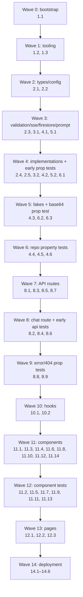
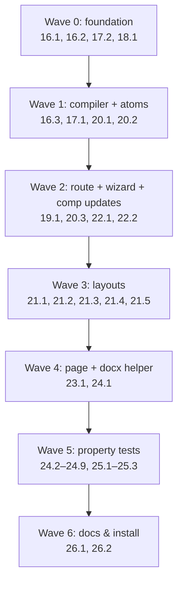

# Implementation Plan: BelajarBareng AI

## Overview

Pipeline implementasi MVP BelajarBareng AI sebagai Next.js 14 (App Router) full-stack TypeScript app yang dideploy ke Google Cloud Run. Urutan task disusun bottom-up: bootstrap project → tipe & validasi → repository & client → API routes → komponen UI → pages → containerization. Setiap properti korelasi (Property 1–12) dijadikan sub-task uji terpisah dan diletakkan dekat dengan modul yang divalidasinya supaya error tertangkap awal. Bahasa implementasi: **TypeScript** (sudah dipilih di fase Clarify).

## Tasks

- [ ] 1. Bootstrap project Next.js 14 + tooling
  - [ ] 1.1 Inisialisasi Next.js 14 App Router project dengan TypeScript
    - Buat `package.json`, `tsconfig.json`, `next.config.mjs` (dengan `output: 'standalone'`)
    - Buat struktur folder `app/`, `components/`, `lib/`, `hooks/`, `tests/`, `public/`
    - Tambah dependency runtime: `next@14`, `react@18`, `react-dom@18`, `@google/generative-ai`, `@google-cloud/firestore`, `zod`, `react-markdown`, `remark-gfm`, `framer-motion`, `clsx`
    - Tambah dependency dev: `typescript`, `@types/node`, `@types/react`, `vitest`, `@vitest/coverage-v8`, `@testing-library/react`, `@testing-library/jest-dom`, `jsdom`, `fast-check`, `tailwindcss`, `postcss`, `autoprefixer`
    - Konfigurasi script `dev`, `build`, `start`, `test`, `test:run`, `lint`
    - _Requirements: 13.1, 13.3_

  - [ ] 1.2 Konfigurasi Tailwind CSS dan Framer Motion
    - Buat `tailwind.config.ts` dengan content scan ke `app/`, `components/`
    - Buat `postcss.config.js`
    - Buat `app/globals.css` dengan Tailwind base/components/utilities
    - Buat `app/layout.tsx` minimal (font Inter, body className) yang import `globals.css`
    - _Requirements: 1.1, 2.1_

  - [ ] 1.3 Konfigurasi Vitest untuk unit + property tests
    - Buat `vitest.config.ts` dengan environment `jsdom`, alias `@/*` ke root, setupFiles `tests/setup.ts`
    - Buat `tests/setup.ts` yang import `@testing-library/jest-dom/vitest`
    - Tambah helper `tests/helpers/fast-check-config.ts` dengan default `{ numRuns: 100, seed: deterministic, verbose: true }`
    - _Requirements: All (testing infrastructure)_

- [ ] 2. Tipe inti, konfigurasi, dan validasi
  - [ ] 2.1 Tulis `lib/types.ts` dengan tipe domain
    - Definisikan `ProfileType`, `LearningMode`, `Role`
    - Definisikan interface `Session`, `DocumentContext`, `Message`, `QuizPayload`, `LatihanPayload`, `SummaryPayload`
    - Export semua tipe sebagai barrel module
    - _Requirements: 1.2, 2.2, 2.4, 3.1, 6.1, 7.1, 8.2, 9.1_

  - [ ] 2.2 Tulis `lib/config.ts` untuk env validation fail-fast
    - Validasi `GOOGLE_CLOUD_PROJECT`, `GEMINI_API_KEY`, `GEMINI_MODEL` (default `gemini-1.5-flash`), `PORT`
    - Throw error deskriptif jika missing saat boot
    - Export `config` object yang typed
    - _Requirements: 13.2, 13.3_

  - [ ] 2.3 Tulis `lib/validation.ts` dengan Zod schemas + guards
    - Schema `profileTypeSchema`, `learningModeSchema`, `quizPayloadSchema`, `latihanPayloadSchema`, `summaryPayloadSchema`
    - Schema request body: `createSessionBodySchema`, `chatBodySchema`, `summaryBodySchema`
    - Function `validateUpload(mimeType, sizeBytes)` returns `{ ok: true } | { ok: false, status: 400|413, error: string }` dengan pesan Indonesia persis sesuai design
    - Class `SchemaValidationError extends Error`
    - _Requirements: 2.5, 2.6, 11.3_

  - [ ] 2.4 Tulis property test untuk validasi upload
    - **Property 5: Validasi upload menolak input invalid**
    - **Validates: Requirements 2.5, 2.6**
    - File: `tests/properties/property-5-validate-upload.test.ts`
    - Tag: `Feature: belajar-bareng-ai, Property 5: Upload validation rejects invalid input`
    - Generator: arbitrary `(mimeType: string, sizeBytes: 0..20MB)`. Assert tiga branch: non-PDF → 400, PDF > 10MB → 413, PDF ≤ 10MB → ok
    - _Requirements: 2.5, 2.6_

  - [ ] 2.5 Tulis property test untuk Zod schema enforcement output AI
    - **Property 8: Output AI terstruktur sesuai schema**
    - **Validates: Requirements 6.1, 6.2, 7.1, 8.2, 8.3**
    - File: `tests/properties/property-8-structured-output.test.ts`
    - Tag: `Feature: belajar-bareng-ai, Property 8: AI structured output validates against schema`
    - Generator: arbitrary objek (campuran valid + invalid) terhadap `quizPayloadSchema`, `latihanPayloadSchema`, `summaryPayloadSchema`. Assert: valid input → parse sukses; invalid input → throw `SchemaValidationError`
    - _Requirements: 6.1, 6.2, 7.1, 8.2, 8.3_

- [ ] 3. SSE helpers
  - [ ] 3.1 Tulis `lib/sse.ts`
    - Type `SseEvent = { type: 'token' | 'payload' | 'done' | 'error'; data: unknown }`
    - Function `encodeSseEvent(evt)` → string `event: <type>\ndata: <json>\n\n`
    - Function `parseSseEvents(buffer: string)` → `{ events: SseEvent[]; remainder: string }` untuk consumer client
    - Helper `createSseStream()` yang return `{ stream: ReadableStream, write(evt), close() }` untuk route handler
    - _Requirements: 4.3, 10.2, 10.3_

  - [ ] 3.2 Tulis property test untuk SSE encoding round-trip
    - **Property 9: SSE stream berformat valid dan non-buffered**
    - **Validates: Requirements 4.3, 4.4, 10.2, 10.3**
    - File: `tests/properties/property-9-sse-format.test.ts`
    - Tag: `Feature: belajar-bareng-ai, Property 9: SSE stream format is valid and non-buffered`
    - Generator: arbitrary array of `SseEvent`. Assert: encode → parse round-trip preserves urutan; setiap frame match regex `^event: \w+\ndata: .+\n\n$`; emisi token pertama via mock async iterable terjadi sebelum upstream close (gunakan timing assertion dengan fake timers)
    - _Requirements: 4.3, 4.4, 10.2, 10.3_

- [ ] 4. Firestore client dan session repository
  - [ ] 4.1 Tulis `lib/firestore.ts` — Firestore Admin client init
    - Inisialisasi `Firestore` dari `@google-cloud/firestore` dengan `projectId` dari config
    - Singleton pattern (cache instance) untuk reuse antar route handler
    - Export `getFirestore()` function
    - _Requirements: 9.1_

  - [ ] 4.2 Tulis `lib/session-repository.ts` — implementasi CRUD
    - Implementasi interface `SessionRepository`: `create`, `get`, `update`, `setDocumentContext`, `appendMessage`, `listMessages`, `saveSummary`
    - `create()` generate `sessionId = crypto.randomUUID()`, set `currentMode='explainer'`, `startedAt=serverTimestamp()`
    - `appendMessage()` simpan ke sub-collection `messages/` dengan `createdAt = serverTimestamp()`
    - `listMessages()` query order by `createdAt ASC`
    - Class `NotFoundError extends Error`, `FirestoreError extends Error`
    - Truncate `documentContext.extractedText` ke max 200 KB dengan suffix "…[dipotong]"
    - _Requirements: 1.2, 2.4, 8.3, 9.1, 9.2, 9.3, 9.4, 14.1, 14.2_

  - [ ] 4.3 Tulis test fake/in-memory `SessionRepository` untuk testing
    - File: `tests/helpers/fake-session-repository.ts`
    - Implementasi sama dengan kontrak `SessionRepository` tapi pakai `Map` in-memory
    - Akan dipakai oleh property tests 2, 3, 4, 12 dan unit tests route handler
    - _Requirements: testing infrastructure_

  - [ ] 4.4 Tulis property test session round-trip persistence
    - **Property 2: Persistensi session round-trip**
    - **Validates: Requirements 1.2, 2.2, 2.4, 3.3, 9.1**
    - File: `tests/properties/property-2-session-roundtrip.test.ts`
    - Tag: `Feature: belajar-bareng-ai, Property 2: Session persistence is round-trip`
    - Generator: arbitrary `Session` (ProfileType, optional topic, LearningMode, optional DocumentContext). Assert: `repo.create()` lalu `repo.update(patch)` lalu `repo.get()` mengembalikan deep-equal ke input gabungan
    - _Requirements: 1.2, 2.2, 2.4, 3.3, 9.1_

  - [ ] 4.5 Tulis property test messages ordering & integrity
    - **Property 3: Persistensi messages preserves urutan dan isi**
    - **Validates: Requirements 9.2, 9.3, 10.3**
    - File: `tests/properties/property-3-messages-ordering.test.ts`
    - Tag: `Feature: belajar-bareng-ai, Property 3: Message persistence preserves order and content`
    - Generator: arbitrary array `Message[]` panjang 1..50. Assert: setelah append berurutan, `listMessages()` mengembalikan array dengan panjang dan urutan & field identik
    - _Requirements: 9.2, 9.3, 10.3_

  - [ ] 4.6 Tulis property test mode switch preserves history
    - **Property 4: Mode switch preserves history**
    - **Validates: Requirement 3.4**
    - File: `tests/properties/property-4-mode-switch.test.ts`
    - Tag: `Feature: belajar-bareng-ai, Property 4: Mode switch preserves message history`
    - Generator: arbitrary session state (history N messages) + arbitrary target mode. Assert: setelah `update({ currentMode })`, `listMessages()` deep-equal pre-state, dan field selain `currentMode` tidak berubah
    - _Requirements: 3.4_

- [ ] 5. Prompt builder
  - [ ] 5.1 Tulis `lib/prompt-builder.ts`
    - Konstanta `BASE_TONE`, `MODE_INSTRUCTION`, `PROFILE_INSTRUCTION` sesuai design
    - Function `buildSystemPrompt({ profile, mode, documentContext?, topic? })` mengembalikan string
    - Sertakan blok `Konteks dokumen:\n<extractedText>` jika ada
    - Sertakan baris `Topik sesi: <topic>` jika ada
    - _Requirements: 1.4, 3.5, 4.1, 5.1, 9.4, 12.1, 12.2, 12.3_

  - [ ] 5.2 Tulis property test komposisi system prompt
    - **Property 1: System prompt komposisi mengandung base, mode, dan profil**
    - **Validates: Requirements 1.4, 3.5, 4.1, 5.1, 9.4, 12.1, 12.2, 12.3**
    - File: `tests/properties/property-1-prompt-composition.test.ts`
    - Tag: `Feature: belajar-bareng-ai, Property 1: System prompt contains base/mode/profile markers`
    - Generator: arbitrary `(profile, mode, optional topic, optional DocumentContext)`. Assert: hasil string mengandung snippet unik dari `BASE_TONE`, `MODE_INSTRUCTION[mode]`, `PROFILE_INSTRUCTION[profile]`; jika documentContext ada → mengandung extractedText; jika topic ada → mengandung topic
    - _Requirements: 1.4, 3.5, 4.1, 5.1, 9.4, 12.1, 12.2, 12.3_

- [ ] 6. Gemini client
  - [ ] 6.1 Tulis `lib/gemini-client.ts`
    - Wrapper di atas `@google/generative-ai` SDK dengan model dari config
    - Function `streamText({ systemPrompt, history, userMessage })` → `AsyncIterable<string>` pakai `model.generateContentStream()`
    - Function `extractFromPdf({ pdfBase64, mimeType, instruction })` → `Promise<string>` kirim inline part `{ inlineData: { data, mimeType } }`
    - Function `generateStructured<T>({ systemPrompt, history, userMessage, schema })` dengan `generationConfig.responseMimeType='application/json'` + `responseSchema`
    - Class `GeminiError extends Error` untuk timeout/5xx/parse fail
    - Encode base64: helper `pdfBufferToBase64(buf: Buffer): string` dan `base64ToPdfBuffer(s: string): Buffer`
    - _Requirements: 2.3, 2.4, 4.1, 4.3, 6.1, 6.2, 7.1, 8.2_

  - [ ] 6.2 Tulis fake `GeminiClient` untuk testing
    - File: `tests/helpers/fake-gemini-client.ts`
    - Mendukung skenario: stream sukses dengan k chunks dengan delay terkontrol, structured response dengan payload arbitrary, throw `GeminiError`
    - _Requirements: testing infrastructure_

  - [ ] 6.3 Tulis property test PDF base64 round-trip
    - **Property 6: PDF base64 encoding adalah round-trip**
    - **Validates: Requirement 2.3**
    - File: `tests/properties/property-6-base64-roundtrip.test.ts`
    - Tag: `Feature: belajar-bareng-ai, Property 6: PDF base64 encode/decode is round-trip`
    - Generator: arbitrary `Uint8Array` panjang 0..1MB. Assert: `base64ToPdfBuffer(pdfBufferToBase64(buf))` byte-equal `buf`
    - _Requirements: 2.3_

- [ ] 7. Checkpoint — verifikasi core lib
  - Jalankan `npm run test:run` untuk memastikan Property 1, 2, 3, 4, 5, 6, 8, 9 lulus dan tidak ada compile error pada `lib/*`. Pastikan semua test pass, tanyakan ke user jika ada pertanyaan.

- [ ] 8. API routes
  - [ ] 8.1 Implementasi `GET /api/health`
    - File: `app/api/health/route.ts`
    - `export const runtime = 'nodejs'`; return `Response.json({ status: 'ok' })`
    - Tidak menyentuh Firestore/Gemini
    - _Requirements: 13.4_

  - [ ] 8.2 Tulis unit test `/api/health`
    - File: `tests/unit/api-health.test.ts`
    - Assert status 200 dan body `{ status: 'ok' }`
    - _Requirements: 13.4_

  - [ ] 8.3 Implementasi `POST /api/session`
    - File: `app/api/session/route.ts`
    - Validasi body via `createSessionBodySchema`
    - `repo.create({ profileType })` → return `{ sessionId, currentMode: 'explainer' }` status 201
    - 400 jika profileType invalid; 503 jika `FirestoreError`
    - _Requirements: 1.2, 1.5, 14.1, 14.2_

  - [ ] 8.4 Tulis property test session unique + PII-free
    - **Property 12: Anonymous session adalah unique dan PII-free**
    - **Validates: Requirements 14.1, 14.2**
    - File: `tests/properties/property-12-anonymous-session.test.ts`
    - Tag: `Feature: belajar-bareng-ai, Property 12: Anonymous session is unique and PII-free`
    - Generator: arbitrary N (10..100) dan profileType array. Assert: N invokasi paralel `repo.create()` menghasilkan N sessionId unik (Set size = N); `JSON.stringify(session)` tidak mengandung key dari blacklist `['name','email','phone','nik','address','nim','nis']` (case-insensitive)
    - _Requirements: 14.1, 14.2_

  - [ ] 8.5 Implementasi `POST /api/upload`
    - File: `app/api/upload/route.ts`
    - Parse `multipart/form-data` (Next 14 native `request.formData()`)
    - Validasi `sessionId` ada via `repo.get()` → 404 jika tidak
    - Validasi MIME + size via `validateUpload()` → 400/413
    - Encode `Buffer` PDF → base64, panggil `geminiClient.extractFromPdf()` dengan instruction `"Ekstrak konten utama PDF ini sebagai teks plain untuk konteks belajar"`
    - Simpan `documentContext` via `repo.setDocumentContext()`
    - Return `{ fileName, sizeBytes, ready: true }`
    - Map error: `GeminiError` → 502 "AI sedang sibuk, coba lagi sebentar"; `FirestoreError` → 503
    - _Requirements: 2.3, 2.4, 2.5, 2.6, 9.4, 11.1, 11.2_

  - [ ] 8.6 Implementasi `POST /api/chat` dengan SSE streaming
    - File: `app/api/chat/route.ts`
    - Validasi body via `chatBodySchema`; trim message → 400 "Pesan tidak boleh kosong" jika empty
    - Hard limit message 4000 char → 400 "Pesan terlalu panjang (max 4000 karakter)"
    - Load session via `repo.get()` → 404 jika null
    - Jika `mode` di body → `repo.update({ currentMode: mode })`
    - `repo.appendMessage(user message)`; `repo.listMessages()` → history
    - `buildSystemPrompt(profile, mode, ctx, topic)` → systemPrompt
    - Branching:
      - `explainer` / `socratic` → `geminiClient.streamText()` → loop yield → `event: token` per chunk → akumulasi → `repo.appendMessage(ai)` → `event: done`
      - `quiz` / `latihan` → `geminiClient.generateStructured()` dengan responseSchema → `event: payload` → `repo.appendMessage(ai with payload)` → `event: done`
    - Wire `AbortSignal` dari `request.signal` ke Gemini stream agar parsial tidak tersimpan saat client disconnect
    - Header response: `Content-Type: text/event-stream`, `Cache-Control: no-cache`, `Connection: keep-alive`
    - Map error: `GeminiError` → SSE `event: error` "AI sedang sibuk, coba lagi sebentar"; `FirestoreError` → 503; `NotFoundError` → 404
    - _Requirements: 3.3, 3.4, 3.5, 4.1, 4.2, 4.3, 5.1, 5.2, 6.1, 6.2, 6.5, 7.1, 7.4, 9.4, 9.5, 10.1, 10.2, 10.3, 11.1, 11.2, 11.3, 12.1_

  - [ ] 8.7 Implementasi `POST /api/summary`
    - File: `app/api/summary/route.ts`
    - Validasi body via `summaryBodySchema`
    - Load session + messages → 404 "Sesi tidak ditemukan atau kosong" jika session null atau messages.length === 0
    - `geminiClient.generateStructured<SummaryPayload>()` dengan schema `summaryPayloadSchema`
    - `repo.saveSummary(sessionId, payload)` → return `SummaryPayload`
    - 502/503 mapping error sama seperti chat
    - _Requirements: 8.2, 8.3, 8.5, 11.1, 11.2_

  - [ ] 8.8 Tulis property test 404 mapping
    - **Property 10: Resource yang tidak ada mengembalikan 404**
    - **Validates: Requirements 8.5, 9.5**
    - File: `tests/properties/property-10-not-found.test.ts`
    - Tag: `Feature: belajar-bareng-ai, Property 10: Missing resources return 404`
    - Generator: arbitrary `sessionId` string yang TIDAK ada di repo, dan kasus session ada tapi messages kosong. Assert: `/api/chat` POST → 404; `/api/summary` POST → 404; body JSON `{ error: string }` dengan pesan Indonesia
    - _Requirements: 8.5, 9.5_

  - [ ] 8.9 Tulis property test error mapping ke status code
    - **Property 11: Error downstream dipetakan ke status code yang tepat**
    - **Validates: Requirements 11.1, 11.2, 11.3**
    - File: `tests/properties/property-11-error-mapping.test.ts`
    - Tag: `Feature: belajar-bareng-ai, Property 11: Downstream errors map to correct HTTP status`
    - Generator: matriks `(errorSource: 'gemini'|'firestore'|'empty-message', endpoint)`. Assert: GeminiError → 502 "AI sedang sibuk, coba lagi sebentar"; FirestoreError → 503 "Layanan penyimpanan belum tersedia, coba lagi"; empty trimmed message → 400 "Pesan tidak boleh kosong"
    - _Requirements: 11.1, 11.2, 11.3_

- [ ] 9. Checkpoint — verifikasi API layer
  - Jalankan `npm run test:run` untuk memastikan Property 10, 11, 12 dan unit test `/api/health` lulus, dan semua route handler tidak ada error TypeScript. Pastikan semua test pass, tanyakan ke user jika ada pertanyaan.

- [ ] 10. Frontend hooks
  - [ ] 10.1 Tulis `hooks/useSession.ts`
    - On mount: baca `localStorage.belajar.sessionId`; jika tidak ada → expose status `'no-session'`
    - Jika ada: `GET` session metadata + `listMessages` (call `/api/session/{id}` GET — tambahkan endpoint sederhana di route.ts atau gabung ke session POST? Buat endpoint `GET /api/session?id=...` dalam scope task 8.3 jika belum ada)
    - Expose `{ status, session, messages, dispatch }` (status: `no-session` | `hydrating` | `ready` | `error`)
    - Action types: `APPEND_USER_MESSAGE`, `APPEND_AI_TOKEN`, `APPEND_AI_PAYLOAD`, `FINALIZE_AI_MESSAGE`, `SET_MODE`, `SET_ERROR`, `CLEAR_ERROR`
    - _Requirements: 1.3, 9.3, 11.4_

  - [ ] 10.2 Tulis `hooks/useChatStream.ts`
    - Fungsi `sendMessage({ message, mode })` yang `fetch('/api/chat', { method: 'POST', body })`
    - Reader `response.body.getReader()` + `TextDecoder` → buffer + `parseSseEvents` → dispatch action ke session reducer
    - Handle `event: token` (debounce render ~50ms via rAF), `event: payload`, `event: done`, `event: error`
    - Expose `{ sendMessage, isStreaming, lastError, retry }` di mana `retry()` mengirim ulang pesan terakhir
    - _Requirements: 4.3, 4.4, 10.2, 10.3, 11.4_

- [ ] 11. Frontend components
  - [ ] 11.1 Komponen `OnboardingScreen.tsx`
    - Toggle dua kartu: Mahasiswa | Pelajar SMA dengan animasi Framer Motion
    - Tombol "Mulai Belajar" disabled jika belum pilih
    - On submit: `POST /api/session`, simpan `sessionId` ke localStorage, push `/chat` dengan `useRouter`
    - Tampilkan inline error jika gagal
    - _Requirements: 1.1, 1.2, 1.3, 1.5_

  - [ ] 11.2 Tulis unit test `OnboardingScreen.tsx`*
    - File: `tests/unit/onboarding-screen.test.tsx`
    - Test: render dua kartu, tombol disabled saat belum pilih, klik kartu enable tombol, klik tombol memanggil fetch `/api/session`
    - _Requirements: 1.1, 1.5_

  - [ ] 11.3 Komponen `ModeSelector.tsx`
    - Segmented control 4 mode dengan icon (gunakan Framer Motion layoutId untuk animasi pill)
    - Props: `currentMode`, `onChange(mode)`
    - Mode labels: Penjelas, Sokratik, Kuis, Latihan
    - _Requirements: 3.1, 3.2, 3.3_

  - [ ] 11.4 Komponen `MessageBubble.tsx`
    - Props: `role`, `content`, `mode`, optional `payload`
    - Render markdown via `react-markdown` + `remark-gfm` untuk role `ai` dan `user`
    - Style berbeda untuk user vs ai (user: kanan, ai: kiri)
    - _Requirements: 4.4_

  - [ ] 11.5 Komponen `ChatStream.tsx`
    - Consume messages dari session store, render `<MessageBubble />` per message
    - Untuk `payload.kind === 'quiz'` render `<QuizComponent />`
    - Untuk `payload.kind === 'latihan'` render `<LatihanComponent />`
    - Auto-scroll ke bottom saat message baru
    - Tampilkan typing indicator saat `isStreaming`
    - _Requirements: 4.3, 4.4, 6.3, 6.4, 7.2_

  - [ ] 11.6 Komponen `QuizComponent.tsx`
    - Props: `payload: QuizPayload`
    - `mcq` → grup radio dari `options[]`; `essay` → `<textarea>`
    - Tombol "Cek Jawaban" → trigger submit dengan `message = JSON.stringify({ kind: 'quiz_answer', answer })`
    - Setelah feedback diterima, tampilkan banner benar/salah + penjelasan
    - _Requirements: 6.3, 6.4, 6.5, 6.6_

  - [ ] 11.7 Tulis unit test `QuizComponent.tsx`*
    - File: `tests/unit/quiz-component.test.tsx`
    - Test: render mcq dengan options sebagai radio, render essay dengan textarea, klik "Cek Jawaban" memanggil callback dengan jawaban yang dipilih
    - _Requirements: 6.3, 6.4_

  - [ ] 11.8 Komponen `LatihanComponent.tsx`
    - Props: `payload: LatihanPayload`
    - State `revealed: boolean[]` initialized ke `Array(N).fill(false)`
    - Reducer action `reveal(i)` set `revealed[i] = true` tanpa mengubah index lain
    - Tombol "Tampilkan Langkah" per step; saat revealed, tampilkan `step.detail`
    - Field "Coba Jawaban" → submit ke chat
    - Export reducer terpisah agar bisa di-test
    - _Requirements: 7.2, 7.3, 7.4_

  - [ ] 11.9 Tulis property test latihan reveal isolated
    - **Property 7: Latihan reveal hanya membuka step yang dipilih**
    - **Validates: Requirement 7.3**
    - File: `tests/properties/property-7-latihan-reveal.test.ts`
    - Tag: `Feature: belajar-bareng-ai, Property 7: Latihan reveal opens only selected step`
    - Generator: arbitrary `N: 1..20`, arbitrary index `i ∈ [0,N)`. Assert: `revealReducer(initial, reveal(i)).revealed[i] === true` dan untuk semua `j !== i`, `next.revealed[j] === initial.revealed[j]`
    - _Requirements: 7.3_

  - [ ] 11.10 Komponen `SummaryView.tsx`
    - Render `topicsCovered`, `keyPoints`, `recommendations` sebagai list dengan animasi Framer Motion stagger
    - Tombol "Mulai Sesi Baru" (clear localStorage + push `/`) dan "Selesai" (push `/`)
    - _Requirements: 8.4_

  - [ ] 11.11 Tulis unit test `SummaryView.tsx`*
    - File: `tests/unit/summary-view.test.tsx`
    - Test: render tiga seksi list, tombol "Mulai Sesi Baru" clear localStorage
    - _Requirements: 8.4_

  - [ ] 11.12 Komponen `ErrorBanner.tsx`
    - Props: `message`, `onRetry`
    - Tampil sebagai sticky banner di atas chat dengan tombol "Coba Lagi"
    - _Requirements: 11.4_

  - [ ] 11.13 Tulis unit test `ErrorBanner.tsx`*
    - File: `tests/unit/error-banner.test.tsx`
    - Test: render message, klik "Coba Lagi" memanggil onRetry
    - _Requirements: 11.4_

  - [ ] 11.14 Komponen `PdfUploader.tsx`
    - Input file dengan accept `application/pdf`
    - Validasi client-side: MIME + size 10MB → tampilkan inline error sebelum kirim
    - On submit: `POST /api/upload` multipart, tampilkan progress, lalu preview metadata (nama + size)
    - Mark sesi siap untuk chat
    - _Requirements: 2.1, 2.3, 2.5, 2.6, 2.7_

- [ ] 12. Pages (App Router)
  - [ ] 12.1 `app/page.tsx` — landing + onboarding
    - Cek `localStorage.belajar.sessionId` di client component
    - Jika ada → `router.push('/chat')`
    - Jika tidak → render `<OnboardingScreen />`
    - _Requirements: 1.1, 1.3, 1.5_

  - [ ] 12.2 `app/chat/page.tsx` — main chat experience
    - Layout: header (`<ModeSelector />` + tombol "Akhiri Sesi") + `<ChatStream />` + footer (`<PdfUploader />` + input + tombol kirim)
    - Pakai `useSession()` + `useChatStream()`
    - Tombol "Akhiri Sesi" → `POST /api/summary` lalu push `/summary` dengan state
    - Tampilkan `<ErrorBanner />` saat `lastError`
    - _Requirements: 2.1, 3.1, 3.3, 4.4, 6.3, 6.4, 7.2, 8.1, 11.4_

  - [ ] 12.3 `app/summary/page.tsx` — summary view
    - Baca summary dari state (sessionStorage atau query param) dan render `<SummaryView />`
    - Jika tidak ada summary → fallback redirect ke `/chat`
    - _Requirements: 8.1, 8.4_

- [ ] 13. Checkpoint — integrasi UI ↔ API
  - Jalankan `npm run build` untuk memastikan Next.js compile sukses dan `npm run test:run` untuk semua property + unit test lulus. Pastikan semua test pass, tanyakan ke user jika ada pertanyaan.

- [ ] 14. Containerization & deployment config
  - [ ] 14.1 Tulis `Dockerfile` multi-stage Next.js standalone
    - Stage `deps`: `node:20-alpine`, `npm ci`
    - Stage `builder`: copy node_modules + source, `npm run build` dengan `NEXT_TELEMETRY_DISABLED=1`
    - Stage `runner`: copy `.next/standalone`, `.next/static`, `public/`; non-root user `nextjs:1001`; `EXPOSE 8080`; `CMD ["node", "server.js"]`
    - _Requirements: 13.1, 13.2, 13.3_

  - [ ] 14.2 Tulis `.dockerignore`
    - Exclude `node_modules`, `.next`, `.git`, `tests`, `.env*`, `.kiro`, `*.md`
    - _Requirements: 13.1_

  - [ ] 14.3 Verifikasi `next.config.mjs` untuk standalone output
    - Pastikan `output: 'standalone'`
    - Pastikan `experimental.serverActions` tidak diaktifkan (kita pakai route handlers)
    - _Requirements: 13.1_

  - [ ] 14.4 Tulis Cloud Run deploy config
    - File: `deploy/cloud-run.yaml` (referensi config) atau `deploy/deploy.sh` untuk `gcloud run deploy`
    - Region `asia-southeast2`, memory 1Gi, cpu 1, concurrency 80, timeout 300s, min-instances 0, max-instances 5
    - Env vars: `NODE_ENV=production`, `GOOGLE_CLOUD_PROJECT`, `GEMINI_MODEL=gemini-1.5-flash`
    - Secret `GEMINI_API_KEY` dari Secret Manager
    - Service account `belajar-bareng-runtime@$PROJECT.iam.gserviceaccount.com` dengan role `roles/datastore.user`
    - _Requirements: 13.1, 13.2, 13.3, 13.4_

  - [ ] 14.5 Tulis `.env.example`
    - Dokumentasikan `GOOGLE_CLOUD_PROJECT`, `GEMINI_API_KEY`, `GEMINI_MODEL`, `PORT` dengan nilai contoh
    - _Requirements: 13.2, 13.3_

  - [ ] 14.6 Tulis README.md singkat dengan instruksi build & deploy*
    - Section: prerequisites, local dev, run tests, build docker, deploy ke Cloud Run
    - _Requirements: 13.1, 13.2, 13.3, 13.4_

- [ ] 15. Final checkpoint — verifikasi end-to-end
  - Jalankan `npm run test:run` (semua 12 property + unit tests harus pass), `npm run build`, dan `docker build -t belajar-bareng-ai:local .` untuk memverifikasi container build sukses. Pastikan semua test pass, tanyakan ke user jika ada pertanyaan.

## Notes

- Tasks marked with `*` are optional dan bisa di-skip untuk MVP cepat — biasanya unit test komponen UI murni (tampilan).
- Setiap task referensi requirement spesifik untuk traceability.
- Property tests (Property 1–12) **tidak** dimark optional karena memvalidasi correctness universal.
- Checkpoints di task 7, 9, 13, 15 memberi titik validasi inkremental.
- Bahasa implementasi: TypeScript. Bahasa UI/error message: Indonesia (per Requirement 12).
- Generator fast-check default `numRuns: 100`, seed deterministik di CI; tag setiap property dengan `Feature: belajar-bareng-ai, Property X: <text>` untuk filter di UI.
- Mock Firestore via fake in-memory repository; mock Gemini via fake client. Integration test ke Firestore emulator hanya jika waktu memungkinkan (di luar scope MVP task ini).
- API route `GET /api/session?id=...` ditambahkan ke task 8.3 sebagai bagian dari implementasi session route untuk mendukung hydrate hook (task 10.1).

## Task Dependency Graph

```json
{
  "waves": [
    { "id": 0, "tasks": ["1.1"] },
    { "id": 1, "tasks": ["1.2", "1.3"] },
    { "id": 2, "tasks": ["2.1", "2.2"] },
    { "id": 3, "tasks": ["2.3", "3.1", "4.1", "5.1"] },
    { "id": 4, "tasks": ["2.4", "2.5", "3.2", "4.2", "5.2", "6.1"] },
    { "id": 5, "tasks": ["4.3", "6.2", "6.3"] },
    { "id": 6, "tasks": ["4.4", "4.5", "4.6"] },
    { "id": 7, "tasks": ["8.1", "8.3", "8.5", "8.7"] },
    { "id": 8, "tasks": ["8.2", "8.4", "8.6"] },
    { "id": 9, "tasks": ["8.8", "8.9"] },
    { "id": 10, "tasks": ["10.1", "10.2"] },
    { "id": 11, "tasks": ["11.1", "11.3", "11.4", "11.6", "11.8", "11.10", "11.12", "11.14"] },
    { "id": 12, "tasks": ["11.2", "11.5", "11.7", "11.9", "11.11", "11.13"] },
    { "id": 13, "tasks": ["12.1", "12.2", "12.3"] },
    { "id": 14, "tasks": ["14.1", "14.2", "14.3", "14.4", "14.5", "14.6"] }
  ]
}
```

### Visual Dependency Graph (mermaid)



## Iteration 2: Per-Mode Layouts & DOCX Support

Iterasi ini menambahkan dukungan DOCX, kompilasi server-side ke Markdown (token-saving), router layout per-mode, Quiz Wizard state machine, dan implementasi visual final untuk Sokratik & Latihan layout (Option B dari research di `design.md`). Task di bawah merujuk requirement baru/extended (2 extended, 4 extended, 5 extended, 6 extended, 7 extended, 15, 16, 17) dan property baru (13–20).

> **Catatan kontinuitas**: tasks 1–15 di atas tetap berlaku — yang sudah `[x]` jangan di-uncheck. Task di bawah ini adalah *delta* iterasi 2; banyak di antaranya memodifikasi file yang sebelumnya dibuat di task 1–11. Setiap task melingkupi satu file (atau pasangan file rename) supaya wave dependency tidak konflik.

- [ ] 16. Foundation updates — types, validation, prompt-builder
  - [ ] 16.1 Update `lib/types.ts`: tambah `MaterialMimeType` union, ganti `DocumentContext.extractedText` → `compiledMarkdown`, tambah `QuizState`, `QuizConfig`, perluas payload typings
    - Tambah union `MaterialMimeType = 'application/pdf' | 'application/vnd.openxmlformats-officedocument.wordprocessingml.document'`
    - Pada `DocumentContext`: `mimeType: MaterialMimeType` (replace literal); `compiledMarkdown: string` (replace `extractedText`); optional `compilerWarnings?: string[]`
    - Tambah type `QuizState = 'idle' | 'uploading' | 'compiled' | 'configuring' | 'running' | 'completed'`
    - Tambah interface `QuizConfig { type: 'essay' | 'mcq' | 'mixed'; count: 3 | 5 | 10; answeredCount: number }`
    - Pada `Session`: tambah `quizState?: QuizState`, `quizConfig?: QuizConfig`
    - Perluas `SocraticPayload`: `hints: [string, string, string] | string[]` (tepat 3 hint, samar→spesifik), `depth?: number`
    - Perluas `QuizPayload`: tambah `index: number`, `total: number` untuk progress
    - Perluas `LatihanPayload`: tambah `difficulty?: 'mudah' | 'sedang' | 'sulit'`
    - _Requirements: 2.4, 5.3, 5.4, 6.7, 7.5, 15.1, 16.1, 16.5, 17.1_

  - [ ] 16.2 Update `lib/validation.ts`: terima PDF + DOCX di `validateUpload`
    - Branch baru: jika MIME bukan `application/pdf` dan bukan `application/vnd.openxmlformats-officedocument.wordprocessingml.document` → return `{ ok: false, status: 400, error: 'Hanya file PDF atau DOCX yang didukung' }` (Req 2.7 wording)
    - Branch size > 10 MB → 413 dengan pesan existing
    - Branch valid → `{ ok: true }`
    - Update `chatBodySchema` dan schema lain bila ada referensi `extractedText` (tidak ada karena schema body tidak menyimpan compiledMarkdown — server-only)
    - _Requirements: 2.4, 2.5, 2.6, 2.7, 16.1_

  - [ ] 16.3 Update `lib/prompt-builder.ts`: baca `documentContext.compiledMarkdown` saja
    - Ganti referensi `args.documentContext?.extractedText` → `args.documentContext?.compiledMarkdown` di blok `Konteks dokumen:\n...`
    - Tidak ada code-path yang menerima base64/raw bytes — invariant Property 19
    - Tidak ada perubahan public signature `buildSystemPrompt`; payload boleh berubah karena `DocumentContext` shape berubah
    - _Requirements: 16.4, 16.5_

- [ ] 17. Markdown Compiler module
  - [ ] 17.1 Tulis `lib/markdown-compiler.ts` dengan dispatch by MIME
    - Class `CompilerError extends Error` dengan `cause?: unknown`
    - Function `compilePdf({ pdfBase64 }): Promise<CompileResult>` — panggil `geminiClient.extractFromPdf` dengan instruction "Ekstrak konten utama PDF ini sebagai Markdown teks-saja untuk konteks belajar. Jangan sertakan gambar atau image data, hanya struktur dokumen (headings, list, tabel sederhana, paragraf)." Map `GeminiError` → throw `CompilerError`
    - Function `compileDocx({ buffer }): Promise<CompileResult>` — pakai `mammoth.convertToHtml({ buffer })` lalu helper internal `htmlToMarkdown(html)` untuk subset tag (h1–h6, p, ul, ol, li, strong, em, a). Jika hasil < 100 char → fallback ke `mammoth.extractRawText({ buffer })`. Pasang `warnings` dari `html.messages.map(m => m.message)`. Map exception (corrupt zip dsb.) → throw `CompilerError`
    - Function `compile({ mimeType, buffer })` — dispatch: PDF → encode base64 → `compilePdf`; DOCX → `compileDocx`; lain → throw `CompilerError('Unsupported MIME')`
    - Output rule: hasil string tidak pernah mengandung byte mentah; buffer di-drop di akhir scope
    - Export interface `MarkdownCompiler` dan factory `getMarkdownCompiler()` (singleton-ish, untuk reuse)
    - _Requirements: 16.1, 16.2, 16.3, 16.5, 16.7_

  - [ ] 17.2 Tambah dependency `mammoth ^1.7` ke `package.json`
    - Edit `dependencies`: tambah `"mammoth": "^1.7.0"`
    - (Optional) tambah `"turndown": "^7.2.0"` jika `htmlToMarkdown` in-house dirasa kurang; default-nya in-house dulu untuk MVP
    - _Requirements: 16.3_

- [ ] 18. Quiz state machine
  - [ ] 18.1 Tulis `lib/quiz-state-machine.ts` sebagai pure reducer
    - Type `QuizEvent` discriminated union dengan kind: `UPLOAD_STARTED`, `COMPILE_DONE`, `CONFIGURE_OPENED`, `CONFIRM_CONFIG` (dengan `config: QuizConfig`), `BATCH_DONE`, `STOP`
    - Konstan `TRANSITIONS: Record<QuizState, Partial<Record<QuizEvent['kind'], QuizState>>>` sesuai tabel di design (idle→uploading, uploading→compiled, compiled→configuring, configuring→running, running→completed via BATCH_DONE atau STOP)
    - Function `reduceQuiz(state: QuizState, event: QuizEvent): QuizState` — lookup di tabel, fallback no-op jika kombinasi tidak ada (Property 20, Req 17.9)
    - Tidak menyentuh I/O — pure function, tidak ada side effect
    - Export `TRANSITIONS` dan `reduceQuiz` untuk di-test langsung
    - _Requirements: 17.1, 17.2, 17.3, 17.4, 17.5, 17.6, 17.7, 17.8, 17.9, 17.10_

- [ ] 19. Upload route update — DOCX support + cache reuse + safe error
  - [ ] 19.1 Update `app/api/upload/route.ts`
    - Terima MIME PDF + DOCX (`validateUpload` sudah di-update di task 16.2)
    - Sebelum compile: cek cache (Req 16.6) — jika `session.documentContext?.fileName === file.name && session.documentContext.sizeBytes === file.size` → return `{ fileName, sizeBytes, mimeType, ready: true, cached: true }` tanpa kompilasi ulang
    - Pakai `markdownCompiler.compile({ mimeType, buffer })` (dari task 17.1) — hapus call langsung ke `geminiClient.extractFromPdf` dari route ini
    - Build `DocumentContext` dengan `compiledMarkdown` (bukan `extractedText`); panggil `repo.setDocumentContext(sessionId, ctx)`
    - Error mapping: `CompilerError` → 502 `"AI sedang sibuk, coba lagi sebentar"` dan **TIDAK** menulis Document_Context parsial ke Session_Store (Req 16.7)
    - Response shape: `{ fileName, sizeBytes, mimeType, ready: true, cached?: boolean }`
    - _Requirements: 2.3, 2.4, 2.5, 2.6, 2.7, 16.1, 16.2, 16.3, 16.5, 16.6, 16.7_

- [ ] 20. Atomic components
  - [ ] 20.1 Rename `components/PdfUploader.tsx` → `components/DocumentUploader.tsx`
    - Update `accept` attribute: `application/pdf,application/vnd.openxmlformats-officedocument.wordprocessingml.document,.pdf,.docx`
    - Update validasi MIME client-side: terima kedua MIME; pesan error `"Hanya file PDF atau DOCX yang didukung"` (sinkron dengan server)
    - Update preview badge: icon berbeda untuk PDF (📄) vs DOCX (📝) berdasarkan `file.type`
    - Update import path di `app/chat/page.tsx` (dilakukan di task 23.1)
    - _Requirements: 2.1, 2.3, 2.4, 2.6, 2.7, 4.5_

  - [ ] 20.2 Buat `components/AIStatusBox.tsx`
    - Props: `status: 'idle' | 'generating' | 'between' | 'completed'`, `currentIndex?: number`, `total?: number`, `correctCount?: number`, `onStop: () => void`, `onSkip: () => void`
    - Container CSS: `width: clamp(280px, 22vw, 320px); aspect-ratio: 1 / 1; position: sticky; top: 96px;`. Untuk memastikan square pada jsdom (testing), set juga `style.height` numerik = `style.width` ketika ref tersedia (Property 15)
    - Body: avatar/icon + status text dinamis (`"Lagi nyusun soal {i}/{total}..."`, `"Bagus! Lanjut soal berikutnya."`, `"Selesai! {correctCount}/{total} benar."`)
    - Tombol Stop (memanggil `onStop`) dan Skip (memanggil `onSkip`) di footer panel
    - Mobile fallback: pada viewport < 768px container collapse jadi sticky-bottom horizontal pill (gunakan media query Tailwind `md:`)
    - _Requirements: 6.5, 6.6, 6.7, 6.8, 17.10_

  - [ ] 20.3 Buat `components/QuizWizard.tsx` — multi-step setup wizard
    - State machine: gunakan `reduceQuiz` dari `lib/quiz-state-machine.ts` via `useReducer`
    - Step 1 (state ∈ `idle`/`uploading`): render `<DocumentUploader />` centered. Pada `onUploadComplete` → dispatch `UPLOAD_STARTED` (saat file dipilih) lalu `COMPILE_DONE` (saat upload sukses dan response mengembalikan compiledMarkdown — proxied via `ready: true`)
    - Step 2 (state ∈ `compiled`/`configuring`): tiga kartu pilihan tipe `Essay | MCQ | Mixed`. Selecting → dispatch `CONFIGURE_OPENED` (sekali) dan tampung tipe terpilih ke local state
    - Step 3 (state = `configuring` setelah tipe dipilih): tiga radio `3 | 5 | 10` (default 5 highlighted). Tombol "Mulai Kuis" → dispatch `CONFIRM_CONFIG` dengan `{ type, count, answeredCount: 0 }` → state jadi `running`
    - Props: `sessionId`, `onComplete: (config: QuizConfig) => void` — di-trigger di transition ke `running`
    - _Requirements: 6.1, 6.2, 6.3, 6.4, 17.1, 17.3, 17.4, 17.5, 17.6_

- [ ] 21. Layout components
  - [ ] 21.1 Buat `components/layouts/LayoutRouter.tsx`
    - Const `VALID_MODES: readonly LearningMode[] = ['explainer', 'socratic', 'quiz', 'latihan']`
    - Function: jika `currentMode` tidak ada di `VALID_MODES` → render `<PenjelasLayout {...props} />` sebagai fallback (Req 15.5)
    - Switch ke `<PenjelasLayout>`, `<SokratikLayout>`, `<KuisLayout>`, `<LatihanLayout>` berdasarkan mode
    - Props: meneruskan shared `ModeLayoutProps` (session, messages, isStreaming, sendMessage, semua handler chat dari useChatStream)
    - Tidak menyentuh state messages — itu tetap di parent page (Property 18)
    - _Requirements: 15.1, 15.2, 15.3, 15.5_

  - [ ] 21.2 Buat `components/layouts/PenjelasLayout.tsx`
    - Layout: full-height column. `<ChatStream />` flex-1 + composer footer
    - Composer: `<DocumentUploader />` inline kiri + `<input>` text + tombol "Kirim" (extract dari logic existing `app/chat/page.tsx`)
    - Render `<ExplainerComponent>` di dalam `ChatStream` untuk message dengan `payload.kind === 'explainer'` (logic sudah ada — pastikan tetap berjalan via shared props)
    - _Requirements: 4.1, 4.3, 4.4, 4.5, 15.1_

  - [ ] 21.3 Buat `components/layouts/SokratikLayout.tsx` — Option B (two-column rail)
    - Layout desktop (≥ 768px): grid 2-kolom. Kiri (flex-1): `<ChatStream />` filtered ke pasangan tanya-jawab terakhir + history socratic. Kanan (sticky 280–320px): rail berisi
      - **Depth indicator**: angka besar `payload.depth ?? 1` dari pesan AI socratic terakhir + breadcrumb mini (Req 5.4)
      - **Hint stack**: 3 dot lampu (filled/empty) sesuai `hintsRevealed` yang dimiliki `<SocraticComponent>` (lift state via callback prop dari task 22.1)
      - Tombol "Reveal hint berikutnya" (disabled saat hintsRevealed === 3)
      - **Quick replies**: 3 chip (`Aku rasa…`, `Mungkin karena…`, `Saya bingung`) — chip ke-3 langsung trigger `onSocraticConfused`
    - Layout mobile (< 768px): rail collapse jadi bottom-sheet drawer dengan tab `Depth | Hints | Quick`
    - Composer: textarea + tombol "Kirim diskusi" di bottom kolom kiri
    - _Requirements: 5.1, 5.3, 5.4, 5.5, 15.1_

  - [ ] 21.4 Buat `components/layouts/KuisLayout.tsx` — split layout
    - Layout desktop: grid 2-kolom. Kiri (flex-1, scrollable): conditional render
      - Jika `quizState !== 'running'` → `<QuizWizard sessionId={...} onComplete={...} />`
      - Jika `quizState === 'running'` → progress bar (`answeredCount/total`) di top + `<QuizComponent>` untuk soal aktif (dari `messages` terakhir dengan `payload.kind === 'quiz'`)
      - Jika `quizState === 'completed'` → ringkasan hasil batch
    - Kanan (sticky): `<AIStatusBox status={...} currentIndex={...} total={...} onStop={...} onSkip={...} />`
    - Stop handler: `reduceQuiz(state, { kind: 'STOP' })` → jika berubah ke `completed`, fire `AbortController` lewat `useChatStream` (kalau hook mendukung) atau simply `setIsStreaming(false)` di parent
    - Skip handler: `sendMessage({ message: 'skip soal ini', mode: 'quiz' })`
    - Layout mobile: AIStatusBox jadi sticky-bottom horizontal pill
    - _Requirements: 6.1, 6.2, 6.3, 6.4, 6.5, 6.6, 6.7, 6.8, 6.9, 6.10, 6.11, 6.13, 6.14, 15.1, 17.1_

  - [ ] 21.5 Buat `components/layouts/LatihanLayout.tsx` — Option B (two-column attempt-first)
    - Layout desktop: grid 2-kolom. Kiri: pertanyaan + banner "Coba dulu yuk" (hidden setelah `hasAttempted`) + `<textarea>` attempt + tombol `[Coba]/[Cek jawaban]`. Setelah `revealedCount === N` (semua step terbuka) tampilkan tombol `[Lebih mudah]`, `[Lebih sulit]`, `[Soal baru]`
    - Kanan: rail steps (1/N revealed counter di top + list step dengan tombol `[Tampilkan]` per step yang disabled selama `!hasAttempted`)
    - Konsumsi `<LatihanComponent>` yang sudah ada untuk reveal isolation (Property 16) — atau lift `revealReducer` ke layout dan render UI di sini langsung. Pilihan: **lift ke layout** karena rail kanan butuh akses state revealed; pass `revealed[]` + `dispatch` sebagai props ke kolom kiri & kanan
    - Difficulty handlers: panggil `sendMessage({ message: 'Berikan soal yang lebih mudah dengan topik sama', mode: 'latihan' })` dan analog untuk lebih sulit/baru
    - Layout mobile: collapse single-column dengan steps rail jadi accordion below input
    - _Requirements: 7.1, 7.2, 7.3, 7.4, 7.5, 7.6, 15.1_

- [ ] 22. Updates ke komponen existing untuk integrasi layout
  - [ ] 22.1 Update `components/SocraticComponent.tsx`
    - Expose hint reveal state via props opsional: `hintsRevealed?: number`, `onRevealNext?: () => void`. Jika props ini diberikan, komponen jadi controlled (rail kanan SokratikLayout yang owns state); jika tidak, fallback ke internal `useState` (backward compat)
    - Expose `depth` reading dari `payload.depth` ke parent via callback `onDepthChange?: (depth: number) => void` (atau parent baca langsung dari payload — pilih yang lebih simpel: parent baca payload sendiri)
    - Pastikan reveal monotonic & bounded: `hintsRevealed ∈ [0, 3]` (Property 14)
    - _Requirements: 5.3, 5.4, 15.1_

  - [ ] 22.2 Update `components/LatihanComponent.tsx`
    - Expose `revealed` state + `dispatch` ke parent via props opsional: `revealed?: boolean[]`, `onReveal?: (index: number) => void`, `hasAttempted?: boolean`, `onSubmitAttempt?: (attempt: string) => void`. Jika diberikan → controlled mode untuk LatihanLayout; jika tidak → fallback internal (backward compat)
    - Reveal isolation tetap dijaga oleh `revealReducer` yang sudah ada (Property 16 = extension Property 7)
    - Expose tombol difficulty (lebih mudah / lebih sulit / soal baru) — di mode controlled, render hanya saat `revealed.every(Boolean)`. Atau lift tombol ke LatihanLayout dan tidak di-render di sini
    - _Requirements: 7.2, 7.3, 7.5, 15.1_

- [ ] 23. Page integration — chat page
  - [ ] 23.1 Update `app/chat/page.tsx`: pakai LayoutRouter
    - Hapus inline ChatStream + composer + handler-handler khusus mode (extract sebagian sudah dipindah ke layouts)
    - Render hanya: header (brand + `<ModeSelector>` + tombol "Akhiri Sesi") + `<ErrorBanner>` (kondisional) + `<LayoutRouter currentMode={session.currentMode} {...sharedProps}>`
    - `messages` tetap di parent (dimiliki `useSession()`) — tidak di-mount ulang saat `currentMode` berganti (Property 18)
    - `useChatStream(session?.sessionId, dispatch)` tetap di parent — semua layout share instance yang sama
    - Update import: `PdfUploader` → `DocumentUploader` (rename dari task 20.1) — hanya jika ada referensi yang tertinggal di header; kalau sudah dipindah ke `PenjelasLayout` cukup hapus
    - _Requirements: 3.1, 3.2, 3.3, 3.4, 4.5, 8.1, 11.4, 15.1, 15.2, 15.3, 15.4, 15.5_

- [ ] 24. Property tests untuk properti baru (13–20)
  - [ ] 24.1 Tulis helper `tests/helpers/build-docx.ts`*
    - Function `buildSyntheticDocx({ headings: string[], paragraphs: string[] }): Buffer` — build minimal valid DOCX (zip+xml) in-memory tanpa write ke disk
    - Boleh pakai dependency dev `jszip` (atau static fixture file di `tests/fixtures/sample.docx` jika lebih mudah)
    - Dipakai oleh Property 13
    - _Requirements: testing infrastructure_

  - [ ]* 24.2 Tulis property test untuk Markdown_Compiler (DOCX + PDF)
    - **Property 13: Compiled_Markdown non-empty + DOCX bebas dari ZIP signature / OOXML markers**
    - **Validates: Requirements 2.4, 2.5, 16.1, 16.2, 16.3**
    - File: `tests/properties/property-13-compiled-markdown.test.ts`
    - Tag: `Feature: belajar-bareng-ai, Property 13: Compiled markdown non-empty + sanitized`
    - Generator DOCX: arbitrary `(headings, paragraphs)` → `buildSyntheticDocx(...)` → call `compileDocx`. Assert: `compiledMarkdown.length > 0`, tidak mengandung `'PK\x03\x04'`, tidak mengandung `'<w:document'`, tidak mengandung `'</w:'`
    - Generator PDF: pakai fake Gemini client (dari task 6.2) yang return string deterministik → call `compilePdf` → assert non-empty
    - _Requirements: 2.4, 16.1, 16.2, 16.3_

  - [ ]* 24.3 Tulis property test untuk Sokratik hint reveal monotonic & bounded
    - **Property 14: Sokratik hint reveal monotonic dan bounded**
    - **Validates: Requirement 5.3**
    - File: `tests/properties/property-14-socratic-hint-reveal.test.ts`
    - Tag: `Feature: belajar-bareng-ai, Property 14: Socratic hint reveal monotonic + bounded`
    - Generator: arbitrary `H ∈ {1,2,3}`, sequence of `revealNext` actions. Assert: setelah k aksi, `hintsRevealed = min(k, H)`; tidak pernah turun; tidak pernah > H
    - Test pakai `revealReducer` yang dilift dari `SocraticComponent` (export terpisah, mirip `LatihanComponent.revealReducer`)
    - _Requirements: 5.3_

  - [ ]* 24.4 Tulis unit test (best-effort) untuk AIStatusBox dimensions
    - **Property 15: AIStatusBox dimensions stay within bounds** (treated sebagai example test — dimension testing di jsdom approximate)
    - **Validates: Requirements 6.5, 6.6**
    - File: `tests/unit/ai-status-box.test.tsx`
    - Tag: `Feature: belajar-bareng-ai, Property 15: AIStatusBox dimensions (best-effort)`
    - Render `<AIStatusBox status="generating" currentIndex={2} total={5} onStop={...} onSkip={...} />` di jsdom; cek inline style berisi `aspect-ratio: 1 / 1`, `width` clamp ke 280–320 (regex match), `position: sticky`
    - Catatan: jsdom tidak melakukan real layout — kita validasi *intent* (style declaration), bukan computed dimensions
    - _Requirements: 6.5, 6.6_

  - [ ]* 24.5 Tulis property test Latihan attempt-first gating + reveal isolation
    - **Property 16: Latihan attempt-first gating dan reveal isolation**
    - **Validates: Requirements 7.2, 7.3**
    - File: `tests/properties/property-16-latihan-attempt-first.test.ts`
    - Tag: `Feature: belajar-bareng-ai, Property 16: Latihan attempt-first gating + reveal isolation`
    - Generator: arbitrary N ∈ [1,20], arbitrary sequence of reveal indices i₁,…,iK. Assert (a) sebelum `submitAttempt`: untuk setiap reveal action `revealed[*]` tetap `false` array (guard di layout reducer); (b) setelah `submitAttempt`: `revealed[i]` true setelah dispatch reveal(i); (c) untuk semua `j ≠ i`, `revealed[j]` tidak berubah dari nilai sebelum dispatch
    - Implementasi: lift small reducer `latihanGuardReducer({ revealed, hasAttempted })` di `lib/` atau di `LatihanLayout` dan import ke test
    - _Requirements: 7.2, 7.3_

  - [ ]* 24.6 Tulis property test Layout_Router routing + fallback
    - **Property 17: Layout_Router routing correctness dan fallback**
    - **Validates: Requirements 15.1, 15.2, 15.3, 15.5**
    - File: `tests/properties/property-17-layout-router.test.tsx`
    - Tag: `Feature: belajar-bareng-ai, Property 17: LayoutRouter routes valid modes + falls back`
    - Pakai `@testing-library/react` `render(<LayoutRouter currentMode={mode} ...sharedProps />)` dengan mock layouts (stub yang render `data-testid="layout-{mode}"`)
    - Generator: arbitrary string. Jika string ∈ valid modes → `getByTestId('layout-{mode}')` ada; else → `getByTestId('layout-explainer')` ada (fallback)
    - _Requirements: 15.1, 15.2, 15.3, 15.5_

  - [ ]* 24.7 Tulis property test mode switch preserves messages
    - **Property 18: Mode switch preserves messages**
    - **Validates: Requirement 15.4**
    - File: `tests/properties/property-18-mode-switch-preserves.test.tsx`
    - Tag: `Feature: belajar-bareng-ai, Property 18: Mode switch preserves messages`
    - Generator: arbitrary `messages: Message[]` panjang 0..50, pasangan `(modeA, modeB)` dengan `modeA ≠ modeB`. Render parent component yang mounts `<LayoutRouter currentMode={modeA} messages={M} />`; rerender dengan `currentMode={modeB}` (messages prop tetap reference identik atau structural equal). Assert: child layout menerima `messages` dengan length sama dan setiap item deep-equal dengan input
    - Mock layout components yang expose received messages via `data-message-count` attribute atau via spy prop
    - _Requirements: 15.4_

  - [ ]* 24.8 Tulis property test token-saving invariant — no raw bytes in prompts
    - **Property 19: Token-saving invariant — no raw bytes in prompts**
    - **Validates: Requirements 16.4, 16.5**
    - File: `tests/properties/property-19-token-saving.test.ts`
    - Tag: `Feature: belajar-bareng-ai, Property 19: No raw bytes in prompts`
    - Generator: arbitrary `compiledMarkdown` string + arbitrary mode + profile + optional topic. Build `documentContext: DocumentContext` dengan `compiledMarkdown`. Call `buildSystemPrompt(...)`. Assert prompt:
      - TIDAK mengandung `'%PDF-'` (PDF magic bytes header)
      - TIDAK mengandung `'PK\x03\x04'` (ZIP/DOCX signature)
      - TIDAK mengandung pattern base64 long-run (regex `[A-Za-z0-9+/]{200,}={0,2}` — heuristic untuk base64 blob ≥ 200 char)
      - **MENGANDUNG** `compiledMarkdown` substring (sanity)
    - _Requirements: 16.4, 16.5_

  - [ ]* 24.9 Tulis property test Quiz state machine transition table
    - **Property 20: Quiz_State transitions match valid transition table**
    - **Validates: Requirements 17.1, 17.2, 17.3, 17.4, 17.5, 17.6, 17.7, 17.8, 17.9, 17.10**
    - File: `tests/properties/property-20-quiz-state-machine.test.ts`
    - Tag: `Feature: belajar-bareng-ai, Property 20: Quiz state machine transitions valid`
    - Generator: arbitrary `(state ∈ QuizState, event ∈ QuizEvent)`. Assert: jika `(state, event.kind)` ada di `TRANSITIONS` → `reduceQuiz(state, event) === TRANSITIONS[state][event.kind]`; else → `reduceQuiz(state, event) === state` (no-op, Req 17.9)
    - Tambah test eksplisit untuk kasus terminal: `reduceQuiz('completed', any) === 'completed'`
    - _Requirements: 17.1–17.10_

- [ ] 25. Update test existing yang ter-affect oleh perubahan shape
  - [ ]* 25.1 Update `tests/properties/property-1-prompt-composition.test.ts`
    - Ganti assertion `prompt.includes(documentContext.extractedText)` → `prompt.includes(documentContext.compiledMarkdown)`
    - Update generator `DocumentContext` arbitrary supaya hasilkan `compiledMarkdown` (bukan `extractedText`)
    - _Requirements: 1.4, 9.4, 16.4_

  - [ ]* 25.2 Update `tests/properties/property-5-validate-upload.test.ts`
    - Perluas generator MIME type ke include DOCX MIME (`application/vnd.openxmlformats-officedocument.wordprocessingml.document`)
    - Assert: PDF ≤ 10MB → ok; DOCX ≤ 10MB → ok; PDF/DOCX > 10MB → 413; MIME selain dua → 400 dengan error wording `'Hanya file PDF atau DOCX yang didukung'`
    - _Requirements: 2.4, 2.5, 2.6, 2.7_

  - [ ]* 25.3 Verifikasi `tests/properties/property-6-base64-roundtrip.test.ts`
    - Tidak perlu perubahan logic — base64 round-trip masih relevan untuk PDF path di `compilePdf`
    - Jalankan test untuk konfirmasi pass setelah refactor
    - _Requirements: 2.3, 16.2_

- [ ] 26. Wiring & docs
  - [ ] 26.1 Pastikan `package.json` terbaru (post task 17.2) di-install
    - Jalankan `npm install` setelah `mammoth` ditambahkan; commit `package-lock.json` ter-update
    - _Requirements: 16.3_

  - [ ]* 26.2 Update `README.md` untuk mendokumentasikan dukungan format file baru
    - Section "Material Upload" tambahkan: PDF (Gemini multimodal) dan DOCX (mammoth, server-side compile)
    - Section "Per-mode layouts" jelaskan empat layout berbeda yang dipilih oleh `LayoutRouter`
    - Section "Token-saving" tambahkan paragraf: byte mentah file tidak pernah masuk ke prompt — hanya `compiledMarkdown`
    - _Requirements: 2.4, 16.5, 15.1_

- [ ] 27. Final iteration 2 checkpoint — verifikasi ulang end-to-end
  - Jalankan `npm run test:run` (semua property 1–20 + unit tests harus pass), `npm run build` (Next.js compile sukses dengan layout router + new components), dan smoke `docker build -t belajar-bareng-ai:local .` untuk memverifikasi build masih sukses dengan dependency baru. Pastikan semua test pass; tanyakan ke user jika ada pertanyaan.

## Iteration 2 Notes

- File rename `PdfUploader.tsx` → `DocumentUploader.tsx` ditangani di task 20.1; semua import yang masih menunjuk ke `PdfUploader` di-update di task 23.1. Kalau import lain ditemukan saat implementasi, update sekalian.
- Layout components di `components/layouts/` dibuat **baru** (folder belum ada); pastikan struktur folder dibuat di task 21.1.
- Property tests baru (24.2–24.9) ditandai optional `*` mengikuti konvensi di iterasi 1, *kecuali* yang dianggap critical correctness — di sini Property 20 (state machine) dan Property 17 (router fallback) cukup penting tapi tetap di-mark optional supaya konsisten dengan kebijakan; tim boleh memilih running mereka di CI.
- Helper `tests/helpers/build-docx.ts` (task 24.1) ditandai optional karena hanya pendukung Property 13; pakai static fixture jika lebih cepat.
- File yang **TIDAK** boleh disentuh tanpa task baru: `lib/firestore.ts`, `lib/session-repository.ts` (selain `setDocumentContext` shape jika diperlukan — sudah accept `DocumentContext` apa adanya jadi pasti compatible setelah field rename), `lib/gemini-client.ts` (tetap menyediakan `extractFromPdf` yang dipanggil oleh `markdown-compiler` PDF path).
- Backward compatibility: tidak ada — sesi lama dengan `extractedText` dianggap dibuang (kompetisi MVP, no production users).

## Iteration 2 Task Dependency Graph

Wave plan untuk iterasi 2 (hanya task 16.x–27 di bawah; task lama 1.x–15 sudah selesai). Tasks dalam wave yang sama tidak menyentuh file yang sama.

```json
{
  "waves": [
    { "id": 0, "tasks": ["16.1", "16.2", "17.2", "18.1"] },
    { "id": 1, "tasks": ["16.3", "17.1", "20.1", "20.2"] },
    { "id": 2, "tasks": ["19.1", "20.3", "22.1", "22.2"] },
    { "id": 3, "tasks": ["21.1", "21.2", "21.3", "21.4", "21.5"] },
    { "id": 4, "tasks": ["23.1", "24.1"] },
    { "id": 5, "tasks": ["24.2", "24.3", "24.4", "24.5", "24.6", "24.7", "24.8", "24.9", "25.1", "25.2", "25.3"] },
    { "id": 6, "tasks": ["26.1", "26.2"] }
  ]
}
```

### Visual Dependency Graph (mermaid) — Iteration 2



## Workflow Completion

This workflow has produced the design and planning artifacts for **BelajarBareng AI**:
- `requirements.md` — 17 requirements (14 awal + 15 Per-Mode Layout Routing, 16 Markdown Compilation Pipeline, 17 Quiz Wizard State Machine)
- `design.md` — full Next.js 14 architecture, Firestore schema, Gemini integration, SSE protocol, 20 correctness properties (12 dari iterasi awal + 8 baru: 13–20), per-mode layout specifications dari research, deployment & testing strategy
- `tasks.md` — 15 epics dari iterasi awal + 12 epic baru (16–27) dari iterasi 2 dengan property test placement dan dependency graph terpisah

You can begin executing tasks by opening `tasks.md` and clicking "Start task" next to the items. Untuk iterasi 2: rekomendasi mulai dari task 16.1 (update types — semua task lain bergantung pada shape baru).
