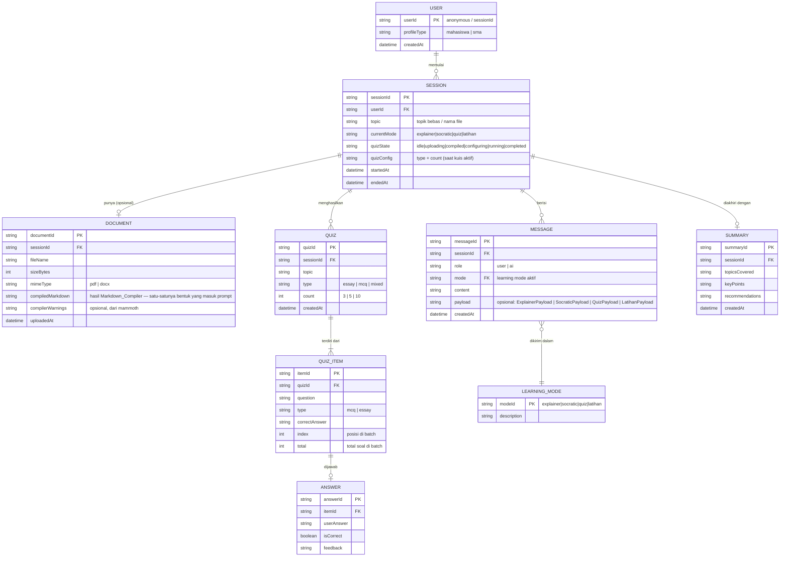
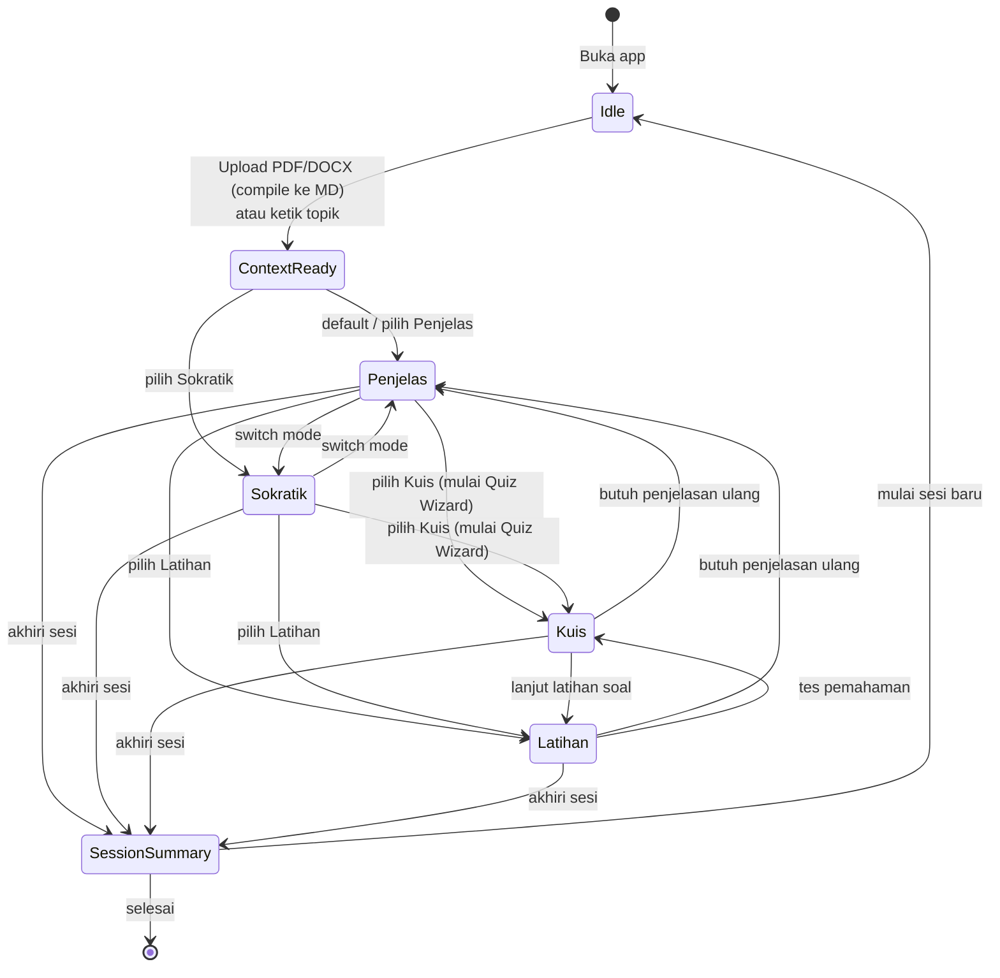
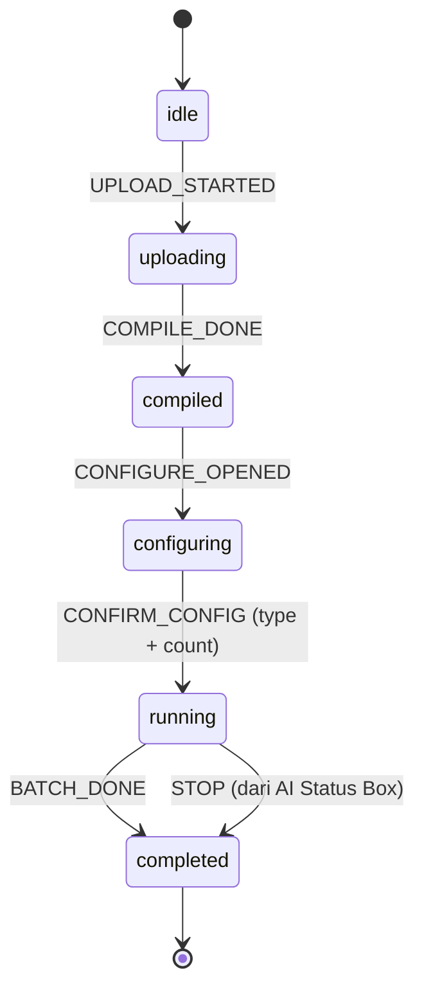
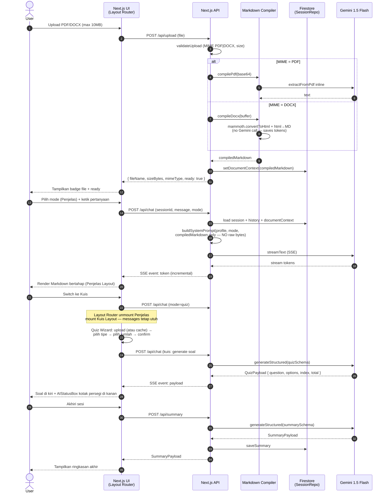

# 📚 PRD — BelajarBareng AI
> Product Requirements Document v1.1
> Kompetisi: #JuaraVibeCoding Google 2026
> Deadline Submission: 31 Mei 2026

> **Changelog v1.1 (16 Mei 2026)**
> - Dukungan upload **PDF + DOCX** (sebelumnya hanya PDF)
> - **Markdown Compiler server-side**: file di-compile ke Markdown sebelum masuk prompt AI (hemat token, byte mentah tidak pernah ikut prompt)
> - **Per-mode layout routing**: tiap mode punya layout sendiri (bukan satu chat universal lagi)
> - **Quiz Wizard**: state machine eksplisit untuk setup kuis (upload → tipe → jumlah → run)
> - Layout Sokratik & Latihan ditetapkan dari riset (Khanmigo, Paul-Elder, Khan Academy, Brilliant, Anki)
> - Session store ditegaskan pakai **Firestore** (bukan in-memory)

---

## 1. Overview

### 1.1 Nama Produk
**BelajarBareng AI** — *Your Personal AI Study Companion*

### 1.2 Tagline
> *"Nggak ada lagi alasan nggak ngerti. Tanya aja."*

### 1.3 Deskripsi Singkat
BelajarBareng AI adalah web app berbasis AI yang hadir sebagai teman belajar personal bagi mahasiswa dan pelajar SMA. User bisa upload materi (**PDF atau DOCX**) atau langsung ketik topik, lalu AI akan menjelaskan, membuat analogi, mengadakan kuis, dan menemani latihan soal — semuanya dalam **empat layout belajar yang berbeda** (Penjelas, Sokratik, Kuis, Latihan) yang adaptif dengan gaya interaksi tiap mode. Materi yang diunggah dikompilasi ke Markdown di sisi server sebelum dikirim ke AI — supaya konteks tetap kaya, tapi token hemat.

---

## 2. Problem Statement

### 2.1 Konteks & Latar Belakang
Di Indonesia, dua kelompok pelajar menghadapi masalah yang sama namun dari sudut berbeda:

**Mahasiswa:**
- Materi kuliah sering kompleks dan tidak diajarkan ulang jika tidak dimengerti
- Banyak yang akhirnya **menyontek** bukan karena malas, tapi karena **tidak paham materi** dan tidak ada tempat bertanya yang aman & tidak menghakimi
- Catatan kuliah sering tidak lengkap karena dosen tidak selalu memberikan poin penting secara eksplisit
- Biaya kuliah mahal, namun pemahaman tidak sebanding — ironi yang nyata

**Pelajar SMA:**
- Gaya mengajar guru tidak selalu cocok dengan cara belajar setiap murid
- Murid sering malu bertanya di kelas, takut dianggap bodoh
- Catatan penting dari guru sering terlewat atau tidak tercatat dengan baik
- Tidak ada media yang sabar dan tersedia 24/7 untuk membantu mereka memahami

### 2.2 Root Cause
```
Tidak paham materi
        ↓
Tidak ada tempat bertanya yang aman & sabar
        ↓
Mengandalkan contekan / teman
        ↓
Pemahaman tidak terbentuk
        ↓
Siklus berulang
```

### 2.3 Dampak yang Ingin Diselesaikan
- Memutus siklus ketidakpahaman → contek → tidak berkembang
- Memberikan akses ke "guru personal AI" yang sabar, tidak menghakimi, tersedia 24/7
- Membantu pelajar membuktikan kemampuan diri sendiri

---

## 3. Target User

### 3.1 Primary User
| Segmen | Profil | Pain Point Utama |
|---|---|---|
| **Mahasiswa** | 18–24 tahun, aktif kuliah, punya laptop/HP | Tidak paham materi, takut bertanya ke dosen, berujung nyontek |
| **Pelajar SMA** | 15–18 tahun, punya akses internet | Cara mengajar guru tidak cocok, malu bertanya, sering lupa mencatat |

### 3.2 Secondary User
- Guru/Dosen yang ingin merekomendasikan alat belajar mandiri ke murid
- Orang tua yang ingin anaknya belajar lebih mandiri

---

## 4. User Stories

### 4.1 Mahasiswa — Andi (21 tahun, Teknik Informatika)
```
SEBAGAI mahasiswa yang kesulitan memahami materi Algoritma,
SAYA INGIN upload slide PDF atau DOCX dari dosen saya dan bertanya langsung ke AI,
AGAR SAYA bisa paham materinya tanpa harus bergantung pada jawaban teman.
```

### 4.2 Pelajar SMA — Rara (16 tahun, kelas XI IPA)
```
SEBAGAI pelajar SMA yang tidak mengerti penjelasan guru Kimia,
SAYA INGIN mengetik "jelasin ke aku tentang ikatan kimia dengan analogi sehari-hari",
AGAR SAYA bisa paham dengan cara yang masuk di kepala saya sendiri.
```

### 4.3 Pelajar SMA — Budi (17 tahun, kelas XII IPS)
```
SEBAGAI pelajar yang akan ujian nasional,
SAYA INGIN dilatih dengan kuis dan latihan soal dari materi yang sudah saya pelajari,
AGAR SAYA bisa mengukur seberapa jauh pemahaman saya sebelum ujian.
```

### 4.4 Mahasiswa — Sinta (19 tahun, Psikologi)
```
SEBAGAI mahasiswa yang ingin berlatih berpikir kritis,
SAYA INGIN mode Sokratik yang memancing saya menjawab dengan pertanyaan-pertanyaan terpandu,
AGAR SAYA membangun pemahaman sendiri, bukan hanya menerima penjelasan jadi.
```

---

## 5. Diagram & Relasi

### 5.1 Use Case Diagram (Teks)

```
[User]
  │
  ├──► [Upload PDF/DOCX  atau  Input Topik Bebas]
  │         │
  │         ▼
  │    [Markdown Compiler — server-side]
  │    PDF → Gemini multimodal → Markdown
  │    DOCX → mammoth → Markdown
  │         │
  │         ▼
  │    [Compiled Markdown disimpan di Document Context]
  │         │
  │         ▼
  │    [Layout Router membaca currentMode]
  │         │
  │    ┌────┴────────────────┬────────────────┬──────────────┐
  │    ▼                     ▼                ▼              ▼
  │ [Penjelas Layout]   [Sokratik Layout]  [Kuis Layout]  [Latihan Layout]
  │ Chat AI↔user        Two-column dengan  Split: soal    Attempt-first
  │ + uploader inline   depth indicator    kiri + AI box  + reveal step
  │ di composer         + hint stack 3 lvl persegi kanan  by step + difficulty
  │    │                     │                │              │
  │    └─────────────────────┴────────┬───────┴──────────────┘
  │                                   │
  │                                   ▼
  │                       [User bisa switch mode kapan saja —
  │                        riwayat pesan tetap aman]
  │
  └──► [Summary Akhir Sesi]
            AI recap apa yang sudah dipahami
```

### 5.2 ER Diagram (Data Model)

Relasi antar entitas data utama dalam BelajarBareng AI. Karena MVP belum punya autentikasi, `User` direpresentasikan via `sessionId` di sisi browser. Persistensi pakai Firestore.



### 5.3 Architecture / Component Diagram

Relasi antar komponen sistem dari client sampai layanan eksternal. Tiga pilar arsitektural baru di v1.1: **Markdown Compiler**, **Layout Router**, dan **Quiz Wizard state machine**.

```mermaid
flowchart LR
    subgraph Client["🌐 Browser (Client)"]
        UI[Next.js UI<br/>Tailwind + Framer Motion]
        ModeSel[Mode Selector]
        Router["Layout Router<br/>(reads currentMode)"]
        Penjelas[Penjelas Layout<br/>chat + uploader inline]
        Sokratik[Sokratik Layout<br/>chat + rail kanan<br/>(depth + hints)]
        Kuis[Kuis Layout<br/>QuizWizard / QuizComponent<br/>+ AIStatusBox kotak persegi]
        Latihan[Latihan Layout<br/>attempt-first + steps rail<br/>+ difficulty controls]
        DocUploader[DocumentUploader<br/>PDF + DOCX]
        MDView[React Markdown Renderer]
    end

    subgraph Server["☁️ Next.js Server on Cloud Run"]
        API_Chat["/api/chat<br/>handler (SSE)"]
        API_Upload["/api/upload<br/>handler (multipart)"]
        API_Summary["/api/summary<br/>handler"]
        API_Health["/api/health"]
        MdCompiler["Markdown Compiler<br/>(lib/markdown-compiler.ts)"]
        Mammoth[mammoth lib<br/>DOCX → Markdown]
        PromptMgr["Prompt Builder<br/>base + mode + profile<br/>+ compiledMarkdown only"]
        SessionRepo[Session Repository]
        QuizSM["Quiz State Machine<br/>(idle→uploading→compiled→<br/>configuring→running→completed)"]
    end

    subgraph Google["🤖 Google Cloud"]
        Gemini[Gemini 1.5 Flash<br/>Multimodal API]
        Firestore[(Firestore<br/>sessions/{id}/messages)]
    end

    UI --> Router
    Router --> Penjelas
    Router --> Sokratik
    Router --> Kuis
    Router --> Latihan
    ModeSel -->|mode change| Router
    Penjelas --> DocUploader
    Kuis --> QuizSM

    DocUploader -->|multipart| API_Upload
    UI -->|chat message + mode| API_Chat
    UI -->|end session| API_Summary

    API_Upload --> MdCompiler
    MdCompiler -->|PDF path| Gemini
    MdCompiler -->|DOCX path| Mammoth
    API_Upload -->|simpan compiledMarkdown| SessionRepo

    API_Chat --> PromptMgr
    PromptMgr -->|systemPrompt + history<br/>(compiledMarkdown only,<br/>NO raw bytes)| Gemini
    API_Chat <-->|read/write| SessionRepo
    API_Summary --> Gemini
    API_Summary <--> SessionRepo

    SessionRepo <--> Firestore
    Gemini -->|stream tokens| API_Chat
    API_Chat -->|SSE| MDView
```

### 5.4 State Diagram — Learning Mode

Transisi antar mode belajar. User boleh switch mode kapan saja tanpa kehilangan konteks percakapan (lihat F-03 & F-06). Layout Router mengganti tampilan, tapi `messages[]` tetap utuh.



### 5.4.1 Sub-state — Quiz Wizard

State machine internal Kuis Layout (Quiz_State). Tidak boleh skip antar state — selalu lewat tabel transisi yang ditetapkan.



### 5.5 Sequence Diagram — Alur Upload Materi & Chat

Alur end-to-end: user upload PDF/DOCX, server kompilasi ke Markdown, user bertanya, AI merespons dalam layout yang sesuai mode aktif.



---

## 6. Fitur & Spesifikasi

### 6.1 Core Features

#### F-01: Dual Input Mode
- **Upload Materi**: User upload **PDF atau DOCX** (materi kuliah, modul, buku pelajaran). Maks 10 MB.
- **Free Topic**: User ketik topik bebas dalam bahasa Indonesia atau Inggris.
- File yang diunggah diproses lewat **Markdown Compiler server-side** sebelum masuk ke prompt AI (lihat F-07).

#### F-02: Learning Mode dengan Layout Berbeda
| Mode | Layout | Trigger |
|---|---|---|
| **Penjelas** | Chat AI↔user, composer punya uploader inline, jawaban di-stream sebagai Markdown | Default / pilihan user |
| **Sokratik** | Two-column (chat kiri + rail kanan: depth indicator + hint stack 3 level + quick replies) — pola dari riset Khanmigo & Paul-Elder | Pilihan user |
| **Kuis** | Split: pertanyaan full-height kiri + AI status box kotak persegi (280–320px) sticky di pojok kanan + Quiz Wizard sebelum mulai | Pilihan user |
| **Latihan** | Two-column attempt-first (input attempt kiri + steps reveal-on-demand kanan) + tombol difficulty setelah selesai — pola dari riset Khan Academy + Brilliant + Anki | Pilihan user |

#### F-03: Per-Mode Layout Routing
- `/chat` page bukan satu chat universal lagi — ada **Layout Router** yang membaca `currentMode` dari sesi dan mount layout target.
- Ganti mode = ganti layout, **tapi `messages[]` tetap utuh** (riwayat pesan dimiliki parent page, bukan layout).
- Fallback: kalau `currentMode` tidak valid, otomatis pakai Penjelas Layout dan server self-heal di request berikutnya.
- Mobile: layout dua-kolom (Sokratik & Latihan) collapse jadi single-column dengan rail jadi bottom-sheet drawer.

#### F-04: Analogi Generator
- User bisa request: *"Jelasin pakai analogi yang relate buat gue"*
- AI generate analogi kontekstual sesuai profil user (mahasiswa/SMA).

#### F-05: Session Summary
- Di akhir sesi, AI otomatis generate ringkasan:
  - Topik yang sudah dibahas
  - Poin pemahaman yang sudah tercapai
  - Rekomendasi topik lanjutan

#### F-06: Mode Selector (UI)
- Toggle clean di header: **Penjelas | Sokratik | Kuis | Latihan**.
- User bisa ganti mode kapan saja. Switch mode trigger Layout Router untuk swap layout, tapi tidak menyentuh history.

#### F-07: Markdown Compilation Pipeline (token-saving)
- File upload (PDF / DOCX) **dikompilasi ke Markdown teks-saja di sisi server** sebelum prompt assembly.
- **PDF path**: encode base64 → kirim inline ke Gemini multimodal dengan instruction "ekstrak konten utama sebagai Markdown".
- **DOCX path**: pakai library `mammoth` (server-side, no Gemini call) → `convertToHtml` → helper `htmlToMarkdown` → fallback ke `extractRawText` kalau hasil terlalu pendek. Lebih cepat dan **tidak makan token sama sekali**.
- **Token-saving invariant**: hanya `compiledMarkdown` yang masuk prompt. Byte mentah PDF/DOCX (header `%PDF-`, signature ZIP `PK\x03\x04`, base64 long-run) tidak pernah ada di prompt setelah compile selesai.
- Cache: kalau user upload file yang sama (nama + size) di sesi yang sama, server skip re-compile dan reuse `compiledMarkdown` yang ada.

#### F-08: Quiz Wizard
- Sebelum kuis berjalan, user dipandu wizard 3 langkah: **upload materi → pilih tipe (essay/MCQ/mixed) → pilih jumlah (3/5/10, default 5)**.
- Wizard di-back oleh state machine eksplisit: `idle → uploading → compiled → configuring → running → completed`. Transisi yang tidak valid (mis. langsung `idle → running`) ditolak — AI selalu punya konteks materi sebelum mulai bikin soal.
- AI generate soal **satu per satu**; AI Status Box di pojok kanan menampilkan progres ("Lagi nyusun soal 3/5...") + tombol **Stop / Skip**.
- `Stop` = transisi `running → completed` segera (membatalkan generation berjalan via AbortController). `Skip` = lompat ke soal berikut tanpa menghitung soal sekarang.

#### F-09: Profile-Adaptive Tone
- Saat onboarding, user pilih profil (`mahasiswa` atau `sma`).
- Sistem prompt menyertakan instruksi tone berbeda untuk tiap profil — analogi mahasiswa beda dengan analogi anak SMA.

### 6.2 Nice-to-Have (Post-MVP)
- [ ] Simpan sesi belajar (riwayat per topik) untuk akun login
- [ ] Highlight bagian dokumen yang sedang dibahas AI
- [ ] Progress tracker mingguan
- [ ] Mode kolaborasi (belajar bareng teman)
- [ ] Export ringkasan ke PDF / Notion

---

## 7. User Flow

```
START
  │
  ▼
[Landing / Onboarding]
  │  Pilih profil (Mahasiswa / SMA) → klik "Mulai Belajar"
  ▼
[Pilih Input]
  ├── Upload PDF/DOCX → [Server compile ke Markdown] → [Mulai Chat]
  └── Ketik Topik → [Mulai Chat]
                          │
                          ▼
                  [Pilih Learning Mode]
                  (Penjelas / Sokratik / Kuis / Latihan)
                          │
                          ▼
                  [Layout Router mount layout target]
                          │
                  ┌───────┼────────┬───────────┐
                  │       │        │           │
                  ▼       ▼        ▼           ▼
              Penjelas Sokratik  Kuis        Latihan
              (chat)   (rail)    (Wizard →   (attempt-first
                                  split)      + steps rail)
                          │
                          ▼
                  [Sesi Percakapan — bisa switch mode]
                  (history aman saat ganti layout)
                          │
                          ▼
                  [Akhiri Sesi → Session Summary]
                          │
                          ▼
                  [Mulai Sesi Baru / Selesai]
END
```

---

## 8. Tech Stack

### 8.1 Frontend
| Teknologi | Kegunaan |
|---|---|
| **Next.js 14** (App Router) | Framework utama, SSR + API routes |
| **TypeScript** | Type safety end-to-end |
| **Tailwind CSS** | Styling minimalist & responsive |
| **Framer Motion** | Animasi UI, mode transition |
| **React Markdown + remark-gfm** | Render response AI dalam format Markdown |

### 8.2 AI & Backend
| Teknologi | Kegunaan |
|---|---|
| **Google AI Studio (Gemini API)** | Core AI engine |
| **Gemini 1.5 Flash** | Model utama (cepat, hemat token, multimodal) |
| **Gemini Multimodal** | Kompilasi PDF → Markdown |
| **mammoth ^1.7** | Kompilasi DOCX → Markdown (server-side, no AI call) |
| **Zod** | Validasi schema request body + response AI terstruktur |
| **Next.js API Routes** | Backend ringan: `/api/chat` (SSE), `/api/upload`, `/api/summary`, `/api/session`, `/api/health` |

### 8.3 Data & Persistence
| Teknologi | Kegunaan |
|---|---|
| **Google Firestore** | Session store: `sessions/{sessionId}` + sub-collection `messages` |
| **In-memory fake repo** | Untuk dev/testing tanpa Firestore real |

### 8.4 Deployment & Infrastructure
| Teknologi | Kegunaan |
|---|---|
| **Google Cloud Run** | Deploy containerized Next.js app ✅ (syarat kompetisi) |
| **Docker** (multi-stage, Next.js standalone) | Containerization |
| **Google Secret Manager** | Simpan `GEMINI_API_KEY` (di-mount sebagai env) |
| **Service Account** dengan `roles/datastore.user` | Akses Firestore via Application Default Credentials |

### 8.5 Testing
| Teknologi | Kegunaan |
|---|---|
| **Vitest** | Unit + property test runner |
| **fast-check** | Property-based testing (20 properti correctness) |
| **@testing-library/react** | Komponen + layout test |

### 8.6 Alasan Pemilihan Stack
- **Gemini Multimodal** → bisa baca PDF langsung tanpa parsing kompleks
- **mammoth** → DOCX → MD tanpa native binding, jalan di Node Alpine, no AI token cost
- **Cloud Run + Firestore** → sesuai syarat kompetisi, auto-scale, bayar per request, single GCP project
- **Next.js + TypeScript** → full-stack dalam satu codebase, type-safe end-to-end, cepat untuk MVP
- **Tailwind** → development UI cepat, hasil minimalist & clean
- **Property-based testing** → bukti correctness untuk juri dan reviewer (token-saving invariant, state machine, layout routing, dll. divalidasi otomatis)

---

## 9. Sistem Prompt Strategy (AI Behavior)

```
System Prompt Base:
"Kamu adalah BelajarBareng AI, teman belajar personal yang sabar dan tidak pernah
menghakimi. Kamu berbicara seperti kakak senior yang pintar dan relate.
Gunakan bahasa Indonesia yang santai tapi informatif.
Selalu ajak user untuk memahami, bukan sekedar menghafal."

+ Mode Penjelas: "Jelaskan dengan analogi sehari-hari yang mudah dipahami pelajar Indonesia."
+ Mode Sokratik:  "Jangan langsung jawab. Ajukan pertanyaan yang memancing user berpikir sendiri."
+ Mode Kuis:      "Buat soal yang relevan dengan materi. Koreksi jawaban dengan penjelasan, bukan hanya benar/salah.
                   Jawab dalam JSON terstruktur sesuai schema QuizPayload."
+ Mode Latihan:   "Bimbing user step-by-step. Jangan langsung kasih jawaban sebelum user mencoba.
                   Jawab dalam JSON terstruktur sesuai schema LatihanPayload."

+ Profile (mahasiswa): "User adalah mahasiswa (18–24 tahun). Pakai analogi yang dekat dengan kehidupan mahasiswa."
+ Profile (sma):       "User adalah pelajar SMA (15–18 tahun). Pakai kosakata dan analogi yang dekat dengan dunia anak SMA."

+ Konteks dokumen (kalau ada):
  "Konteks dokumen:\n{compiledMarkdown}"
  ← HANYA Markdown hasil compile. Byte mentah PDF/DOCX TIDAK PERNAH disertakan di prompt.
```

---

## 10. Riset Layout (Sokratik & Latihan)

Bentuk visual final untuk Sokratik dan Latihan dipilih dari riset literatur & kompetitor. Ringkasan di sini; detail tradeoff ada di `design.md`.

### 10.1 Sokratik
**Sumber referensi**: Khanmigo (Khan Academy), Khanmigo Lite system prompt (DocsBot), Paul-Elder Critical Thinking Framework (Designorate), Adaptation of Paul's Six Types of Socratic Questions (ResearchGate), SocraticAI scaffold paper (arXiv 2512.03501).

**Pola UX yang muncul berulang:**
- Question-first composition (AI bubble paling atas selalu pertanyaan).
- Tiered hint system 3 level (samar → sedang → spesifik).
- Depth indicator (counter atau breadcrumb).
- Reflection prompt cepat ("Aku rasa...", "Mungkin karena...").

**Pilihan layout**: **Two-column dengan rail kanan** (chat kiri + depth + hint stack + quick replies kanan, sticky 280–320px). Konsisten visual dengan Kuis Layout.

### 10.2 Latihan
**Sumber referensi**: Khan Academy practice exercises, Khan walkthrough pattern, Brilliant.org Help Center & FAQ, Anki Manual (active recall + spaced repetition), CMU HCII study on persistence in tutoring, arXiv 2504.10249 (AI-pretesting on task complexity).

**Pola UX yang muncul berulang:**
- Attempt-first gating (input atas, solusi terkunci sampai user submit).
- Step-by-step reveal (satu step terbuka per request).
- Stretchable difficulty (tombol "lebih mudah / lebih sulit" setelah selesai).
- Progress feedback (counter `revealed/total`).

**Pilihan layout**: **Two-column attempt-first** (input attempt kiri + steps rail kanan + difficulty controls muncul saat semua step terbuka). Reveal isolation property dijaga oleh reducer.

---

## 11. Kriteria Penilaian Kompetisi vs Produk Ini

| Kriteria Juri | Bobot | Implementasi di BelajarBareng AI |
|---|---|---|
| **Problem** | 30% | Masalah nyata: mahasiswa nyontek karena tidak paham, pelajar SMA kesulitan belajar mandiri |
| **Solution** | 40% | App fungsional: chat AI + dual input (PDF/DOCX) + 4 layout belajar berbeda + Quiz Wizard + session summary |
| **Uniqueness** | 30% | Per-mode layout routing (tiap mode punya tampilan didesain khusus) + Markdown Compiler hemat token + Quiz Wizard state machine + property-based testing untuk correctness invariant |

---

## 12. Milestones & Timeline

```
Minggu 1 (14–18 Mei 2026) — selesai
├── Setup project Next.js + Tailwind + Firestore + Vitest
├── Integrasi Gemini API (chat dasar + streaming SSE)
├── UI: Landing + Onboarding + Chat interface dasar
└── 12 properti correctness awal di-cover

Minggu 2 (19–24 Mei 2026) — IN PROGRESS (iterasi 2)
├── Markdown Compiler (PDF + DOCX via mammoth)
├── Per-mode layout routing (Layout Router + 4 layout)
├── Quiz Wizard state machine + AI Status Box
├── 8 properti baru (13–20) untuk invariant iterasi 2
└── Update test lama agar sinkron dengan shape compiledMarkdown

Minggu 3 (25–28 Mei 2026)
├── Session Summary feature finalisasi
├── Polish UI/UX + animasi Framer Motion
├── Mobile responsiveness untuk dua-kolom layout
└── Testing end-to-end (Playwright atau manual)

Minggu 4 (29–31 Mei 2026)
├── Deploy ke Google Cloud Run + Firestore
├── Record video demo (2-3 menit)
├── Upload ke LinkedIn + #JuaraVibeCoding
└── Submit formulir ✅
```

---

## 13. Success Metrics (Post-Launch)

| Metrik | Target |
|---|---|
| User bisa mulai sesi belajar dalam < 30 detik | ✅ |
| AI response token pertama < 3 detik | ✅ |
| User bisa switch mode tanpa reload (history aman) | ✅ |
| PDF & DOCX berhasil di-compile ke Markdown | ✅ |
| Token usage per chat turn turun karena tidak ada raw bytes di prompt | ✅ (target ≥ 50% lebih hemat dibanding kirim base64 PDF setiap turn) |
| Quiz Wizard tidak bisa di-skip — AI selalu punya konteks | ✅ (divalidasi Property 20) |
| Session summary muncul di akhir sesi | ✅ |

---

## 14. Risiko & Mitigasi

| Risiko | Probabilitas | Mitigasi |
|---|---|---|
| File besar lambat diproses | Medium | Batasi ukuran file 10 MB; PDF via Gemini multimodal, DOCX via mammoth (lokal, instant) |
| DOCX berformat aneh / image-heavy | Medium | mammoth fallback ke `extractRawText` kalau hasil HTML kecil; warnings disimpan ke `compilerWarnings` |
| Gemini API rate limit | Low | Implementasi debounce + AbortController saat user disconnect; loading state jelas |
| User tidak tahu cara pakai | Medium | Onboarding 1 langkah (pilih profil) + per-mode layout self-explanatory |
| Layout dua-kolom rusak di mobile | Medium | Sokratik + Latihan rail collapse jadi bottom-sheet drawer pada `< 768px` |
| Quiz state machine corrupt (skip step) | Low | Reducer murni dengan tabel transisi tertutup; transisi invalid → no-op (Property 20) |
| `currentMode` corrupt di Firestore | Low | Layout Router fallback ke Penjelas; server self-heal `currentMode = 'explainer'` |
| Deployment Cloud Run gagal | Low | Test di local Docker dulu (`docker build` + `docker run` hit `/api/health`) |

---

*PRD ini dibuat untuk keperluan kompetisi #JuaraVibeCoding oleh Google, 2026.*
*Versi: 1.1 | Tanggal: 16 Mei 2026*
